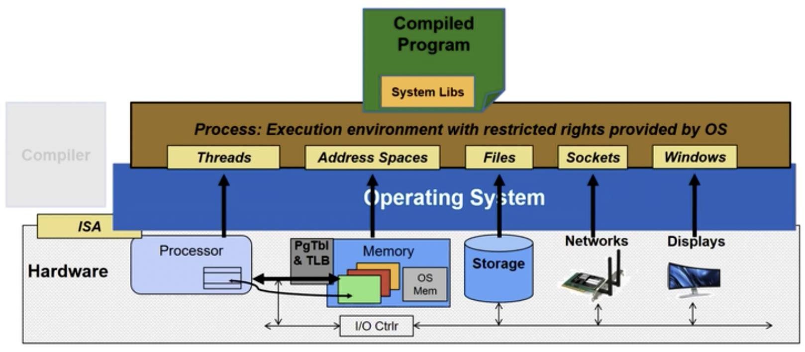
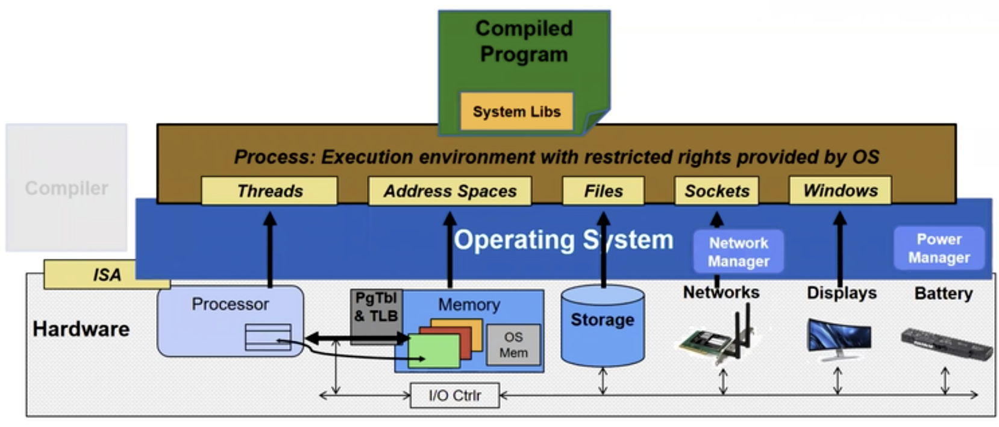
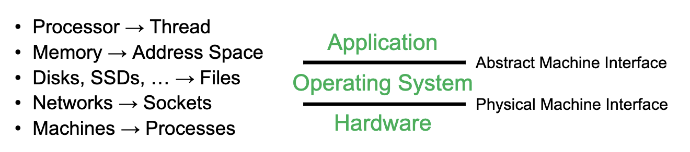
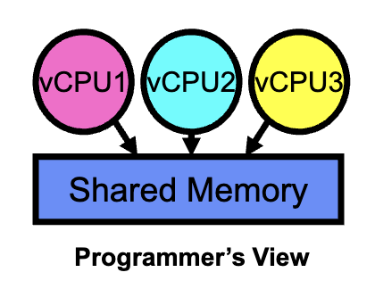
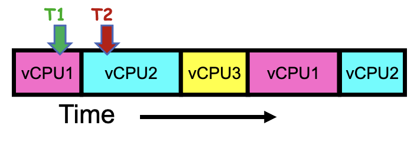
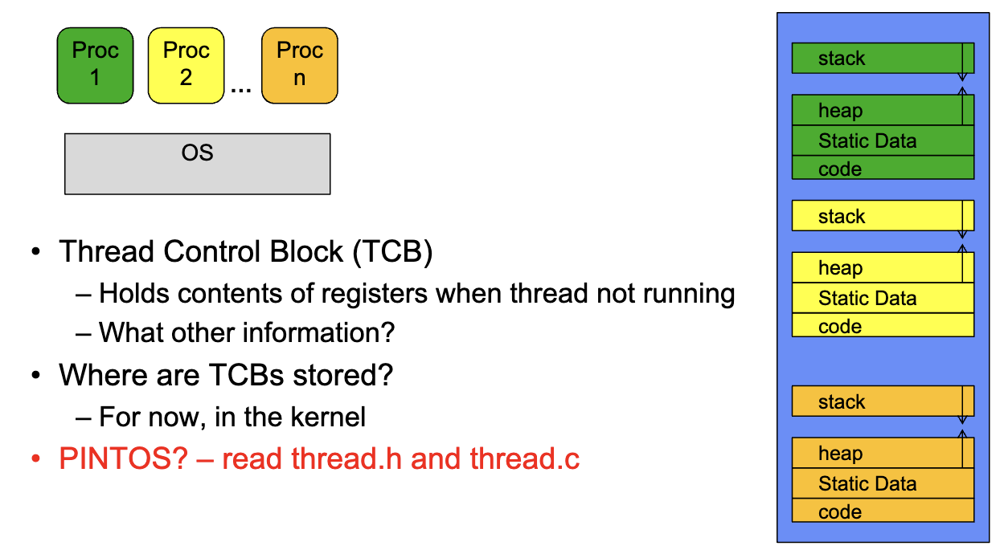
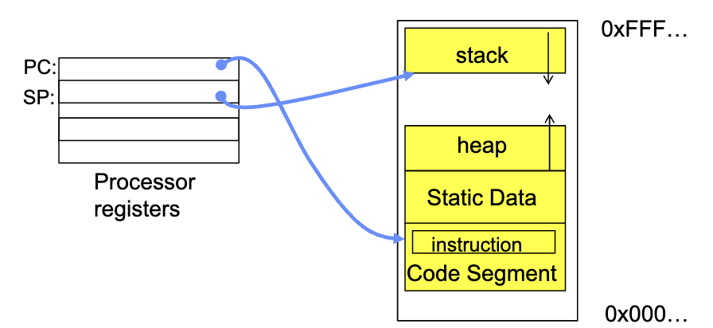
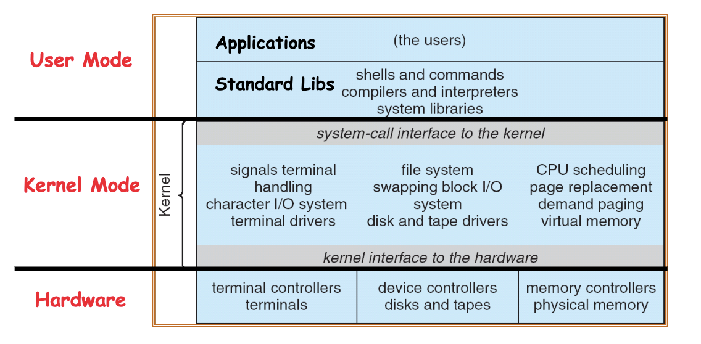
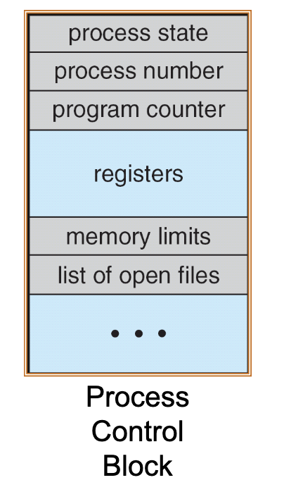
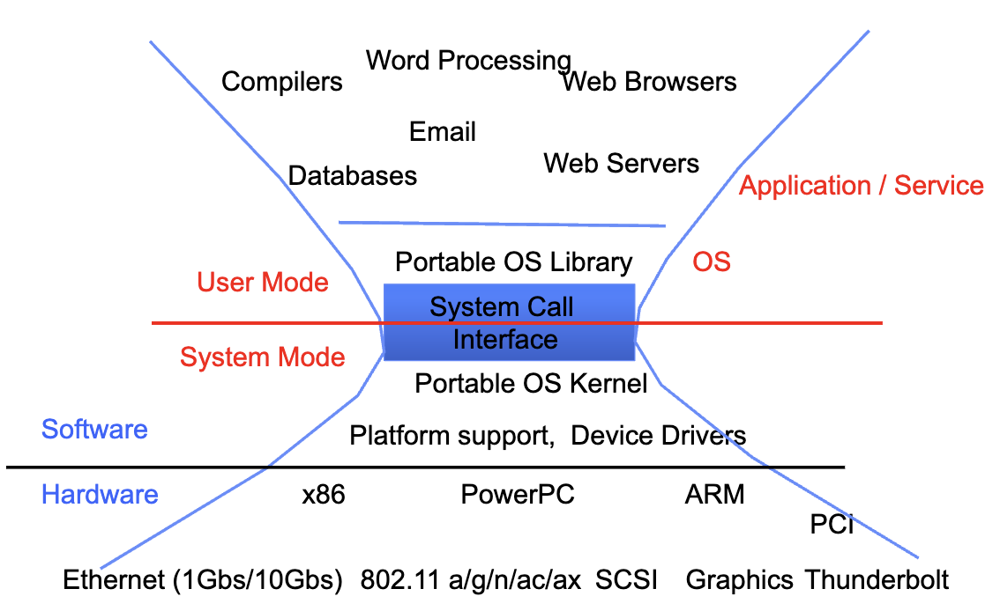

[toc]
# Lec1. What is an Operating System?
[slide](./slides/lec1.pdf)
## Summary
* OS 
  * Provide convenient abstractions to handle diverse hardware
    * Convenience, protection, reliability obtained in creating the illusion
  * Coordinate resources and protect users from each other
     * Using a few critical hardware mechanisms
  * Simplify application development by providing standard services
  * Provide fault containment, fault tolerance, and fault recovery
  * CS162 combines things from many other areas of computer science:
     * Languages, data structures, hardware, and algorithms
* Definiton
  * Not universal
    * Everything a vendor ships when you order an operating system” is good approximation
    * the **Kernel**
      * running at all times on the computer
### OS function
* Referee
  * Manage protection, isolation, and sharing of resources
    * Resource allocation and communication
* Illusionist
  * Provide clean, easy-to-use abstractions of physical resources
    * Infinite memory, dedicated machine
    * Higher level objects: files, users, messages
    * Masking limitations, virtualization
* Glue 
  * Common services
  * Storage, Window system, Networking
  * Sharing, Authorization
  * Look and feel
***Operating Systems are at the Heart of it All***
* Make the incredible advance in the underlying technology available to a 
rapidly evolving body of applications
  *  Provide **consistent abstractions** to applications, even on different hardware
  *  Manage **sharing of resources** among multiple applications

* The key building blocks:
  * Processes
  * Threads, Concurrency, Scheduling, Coordination
  * Address Spaces
  * Protection, Isolation, Sharing, Security
  * Communication, Protocols
  * Persistent storage, transactions, consistency, resilience
  * Interfaces to all devices

## One Definition of an Operating System
* Special layer of software that provides application software access to hardware resources
  * Convenient abstraction of complex hardware devices
  * Protected access to shared resources
  * Security and authentication
  * Communication

## OS Basic
### OS Basic: Protection
* OS isolates processes from each other
* OS isolates itself from other processes
* Even though running on the same hardware
### OS Basic: I/O
* Os provides common services in the form of I/O
### OS Basic: Look and Feel

### OS Basic: Background Management

## Syllabus
* OS Concepts: How to Navigate as a Systems Programmer
  * Process, I/O, Networks and Virtual Machines
* Concurrency
  * Threads, scheduling, locks, deadlock, scalability, fairness
* Address Space
  * Virtual memory, address translation, protection, sharing
* File Systems
  * I/O devices, file objects, storage, naming, caching, performance, paging, transactions, databases
* Distributed Systems
  * Protocols, N-Tiers, RPC, NFS, DHTs, Consistency, Scalability, multicast
* Reliability & Security
  * Fault tolerance, protection,security  

## Conclusion
* Referee
  * Manage protection, isolation, and sharing of resources
    * Resource allocation and communication
* Illusionist
  * Provide clean, easy-to-use abstractions of physical resources
    * Infinite memory, dedicated machine
    * Higher level objects: files, users, messages
    * Masking limitations, virtualization
* Glue 
  * Common services
  * Storage, Window system, Networking
  * Sharing, Authorization
  * Look and feel

# Lec2. Four Fundamental OS Concepts
[slide](./slides/lec2.pdf)

***OS Abstracts Underlying Hardware to help Tame Complexity***

* OS as an Illusionist:
    * Remove software/hardware quirks (fight complexity)
    * Optimize for convenience, utilization, reliability, ... (help the programmer)
* For any OS area (e.g. file systems, virtual memory, networking, scheduling):
    * What hardware interface to handle? (physical reality)
    * What’s software interface to provide? (nicer abstraction

## Four Fundamental OS Concepts
* Thread: Execution Context
  * Fully describes program state
  * Program Counter, Registers, Execution Flags, Stack
* Address space (with or w/o translation)
  * Set of memory addresses accessible to program (for read or write)
  * May be distinct from memory space of the physical machine (in which case programs operate in a virtual address space)
* Process: an instance of a running program
  * Protected Address Space + One or more Threads
* Dual mode operation / Protection
  * Only the “system” has the ability to access certain resources
  * Combined with translation, isolates programs from each other and the OS from programs

## First OS Concept: Thread of Control
* **Thread**: Single unique execution context
    * Program Counter, Registers, Execution Flags, Stack, Memory State
* A thread is **executing** on a processor (core) when it is **resident** in the processor registers
* Resident means: Registers hold the root state (context) of the thread:
    * Including program counter (PC) register & currently executing instruction
      * PC points at next instruction **in memory**
      * **Instructions stored in memory**
    * Including intermediate values for ongoing computations
      * Can include actual values (like integers) or pointers to values **in memory**
    * Stack pointer holds the address of the top of stack (which is in memory)
    * **The rest is “in memory”**
* A thread is suspended (not executing) when its state **is not** loaded (resident) into the processor
    * Processor state pointing at some other thread
    * Program counter register **is not** pointing at next instruction from this thread
    * Often: a copy of the last value for each register stored in memory
### Illusion of Multiple Processors
* Assume a single processor (core).  How do we provide the illusion of multiple processors?
   * Multiplex in time!
* Threads are **virtual cores**
* Contents of virtual core (thread):
   * Program counter, stack pointer
   * Registers
* Where is “it” (the thread)?
   * On the real (physical) core, or
   * Saved in chunk of memory – called the Thread Control Block (TCB)

### Multiprogramming - Multiple Threads of Control

## Second OS Concept: Address Space
* Address space $ \rightarrow $ the set of accessible addresses + state associated with them:
   * For 32-bit processor: $2^{32}$ = 4 billion ($10^9$ )  addresses
   * For 64-bit processor: $2^{64}$ = 18 quintillion ($10^{18}$ ) addresses
* What happens when you read or write to an address?
   * Perhaps acts like regular memory
   * Perhaps ignores writes
   * Perhaps causes I/O operation
     * (Memory-mapped I/O)
   * Perhaps causes exception (fault)
   * Communicates with another program

question here!!!
### Protections
#### Paged Virtual Address Space
Hardware translates address using a **page table**

## Third OS Concept: Process
* **Definition**: execution environment with Restricted Rights
   * (Protected) Address Space with One or More Threads
   * Owns memory (address space)
   * Owns file descriptors, file system context, ...
   * Encapsulate one or more threads sharing process resources
  * Application program executes as a process
   * Complex applications can fork/exec child processes [later!]
  * Why processes? 
    * Protected from each other!
    * OS Protected from them
    * Processes provides memory protection
  * Fundamental tradeoff between protection and efficiency
    * Communication easier withina process
    * Communication harder between processes

* Single and Multithreaded Processes
  * Threads encapsulate concurrency:
    * “Active” component
  * Address spaces encapsulate protection:
    * “Passive” component
    * Keeps buggy programs from crashing the system
  * Reason for multiple threads
    * Parallelism: Take advantages of hardware resource
    * Concurrency: Easy handle with other events as Interrupts
* Protection and Isolation
  * Process necessarity:
    * Reliability
    * Security and privacy
    * Fairness(shares of memory)
  * Mechanisms
    * Address translation
    * Hardware must support **privilege levels**

## Fourth OS Concept: Dual Mode Operation
* **Hardware** provides at least two modes (at least 1 mode bit):
   1. **Kernel Mode** (or “supervisor” mode)
   2. **User Mode**
* Certain operations are **prohibited** when running in user mode
* Changing the page table pointer, disabling interrupts, interacting directly w/ hardware, writing to kernel memory
* Carefully controlled transitions between user mode and kernel mode
   * System calls, interrupts, exceptions

### Additional Layers of Protection for Modern Systems
* Additional layers of protection through virtual machines or containers
 * Run a complete operating system in a virtual machine
 * Package all the libraries associated with an app into a container for execution

* Simple B&B: 
  * User $\rightarrow$ Kernel
  * Interrupt
  * Switch User Process
  * Resume
### Process Control Block

# Lec3. Abstractions 1: Threads and Processes A quick,programmer's viewpoint 
Processes, System Calls, and Fork
[slide](https://inst.eecs.berkeley.edu/~cs162/sp22/static/lectures/3-1up.pdf)
### Conclusion
* Threads are the OS unit of concurrency
  * Abstraction of a virtual CPU core
  * Can use pthread_create, etc., to manage threads within a process
  * They  share data $\rightarrow$ need synchronizaƟon to avoid data races
* Processes consist of one or more threads in an address space
  * Abstraction  of the machine: execution environment for a program
  * Can  use fork, exec, etc. to manage threads within a process
* We  saw the role of the OS library
  * Provide API to programs
  * Interface  with the OS to request services

* Process: execution environment with Restricted Rights
   * Address Space with One or More Threads
   * Owns memory (address space)
   * Owns file descriptors, file system context, ...
   * Encapsulate one or more threads sharing process resources
* Interrupts
   * Hardware mechanism for regaining control from user
   * Notification that events have occurred
   * User-level equivalent: Signals
* Native control of Process
   * Fork, Exec, Wait, Signal

### Running Many Programs
  * We have the basic mechanism to 
    * switch between user processes and the kernel, 
    * the kernel can switch among user processes,
    * Protect OS from user processes and processes from each other

* Multiplexing Processes: The Process Control Block
  * Kernel represents each process as a process control block (PCB)
  * Kernel Schedulermaintains a data structure containing the PCBs
  * Give out non-CPU resources
 
* Scheduler
  * Mechanism for deciding which processes/threads receive hardware CPU time, when, and for how long

### Simultaneous Multithreading/Hyperthreading
* Hard
### Is Base and Bound a Good-Enough Protection Mechanism?

### Recall: 3 types of Kernel Mode Transfer
* Syscall
* Interrupt
* Trap or Exception 
#### Implementing Safe Kernel Mode Transfers
#### Hardware support: Interrupt Control
* Interrupt Controller
* Interrupt Vector
* How to take interrupts safely?
* Need for Separate Kernel Stacks
### Kernel System Call Handler

* Vector through well-defined syscall entry points!
* Locate arguments
* Copy arguments
* Validate arguments
* Copy results back 
#### Bootstrapping
#### Process Management API
* exit– terminate a process
* fork– copy the current process
* exec– change the program being run by the current process
* wait– wait for a process to finish
* kill– send a signal(interrupt-like notification) to another process
* sigaction– set handlers for signals

# Lec4. Fork(con't), Introduction to I/O(Everything is a File)
 
### Conclusion
 * System Call Interface is “narrow waist” between user programs and kernel
* Streaming IO: modeled as a stream of bytes
   * Most streaming I/O functions start with “f” (like “fread”)
   * Data buffered automatically by C-library functions
* Low-level I/O: 
   * File descriptors are integers
   * Low-level I/O supported directly at system call level
* STDIN/ STDOUTenable composition in Unix
   * Use of pipe symbols connects STDOUTand STDIN
     * find | grep | wc...
* Device Driver: Device-specific code in the kernel that interacts directly with the device hardware
   * Supports a standard, internal interface
   * Same kernel I/O system can interact easily with different device drivers
* File abstraction works for inter-processes communication (local or 
*nternet)
* Socket: an abstraction of a network I/O queue
   * Mechanism for inter-process communication
  

# Lec5. Sockets and IPC(Finished) Concurrency: Processes and Threads
### Conclusion
* Socket: an abstraction of a network I/O queue (IPC mechanism)
* Processes have two parts
   * One or more Threads (Concurrency)
   * Address Spaces (Protection)
* Concurrency accomplished by multiplexing CPU Time:
   * Unloading current thread (PC, registers)
   * Loading new thread (PC, registers)
   * Such context switching may be voluntary (yield(), I/O operations) or involuntary (timer, other interrupts)