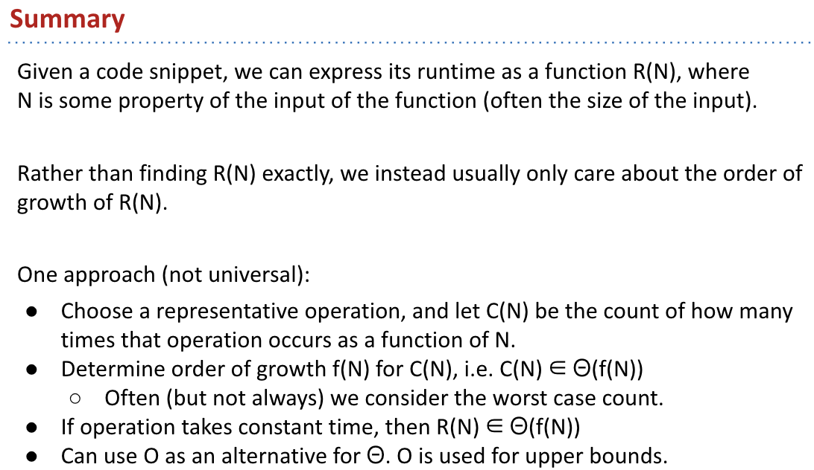
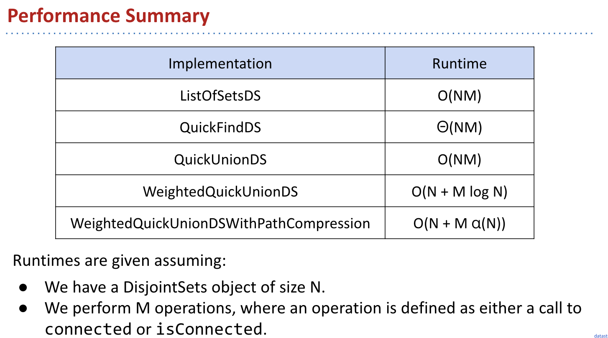

## Phase 2 : Data Structures
* Incredibly important and foundational material: Expect an CS job interview to lean heavily on this part of the course.
* One programming HWs (HW1) and one exam-prep theory HW (HW2).
  * Applications and deeper insight into data structures.
* One very large solo project (Proj 2), due 4/2. Checkpoint due 3/12.
* Labs:
  * Lab 5: Peer review on project 1.
  * Two labs that implement data structures (hash table and BST).
  * Remaining labs are focused on project 2.

## Lecture 12: Command Line Programming and Data Structures Preview

* public static void main(String[] args)
* Command line compilation and execution
* Git Case Study: Maps, Hashing, Serializable

Along the way we got a brief look at 4 different unrelated topics:
* Maps: Same as a Python dictionary.
git构建的方式；
* Hashing: Representing an object by a sequence of (160) bits.
* Serialization: Saving and loading Java objects from a file.
* Graphs: Generalization of a Linked List.
Will talk about Maps, Hashing, and Graphs in much more detail in later lectures.

## Lecture 13: Introduction to Asymptotic Analysis
* Intuitive Runtime
* Detailed Analysis of Worst Case Order of Growth
* Simplified Analysis
* Big Theta Notation
* Big O Notation

Efficiency comes in two flavors:
  * Programming cost (course to date. Will also revisit later).
    * How long does it take to develop your programs?
    * How easy is it to read, modify, and maintain your code?
      * More important than you might think!
      * Majority of cost is in maintenance, not development!
  * Execution cost (from today until end of course).
    * How much time does your program take to execute?
    * How much memory does your program require?

## Lecture 14:Disjoint Sets
* Dynamic Connectivity and the Disjoint Sets Problem
* Quick Find
* Quick Union
* Weighted Quick Union
* Path Compression (CS170 Preview)

*** A Summary of Our Iterative Design Process ***
And we’re done! The end result of our iterative design process is the standard way disjoint sets are implemented today - quick union and path compression.

The ideas that made our implementation efficient:
* Represent sets as connected components (don’t track individual connections).
  * ListOfSetsDS: Store connected components as a List of Sets (slow, complicated).
  * QuickFindDS: Store connected components as set ids.
  * QuickUnionDS: Store connected components as parent ids.
    * WeightedQuickUnionDS: Also track the size of each set, and use size to decide on new tree root.
    * WeightedQuickUnionWithPathCompressionDS: On calls to connect and isConnected, set parent id to the root for all items seen.

## Lecture 15: Asymptotics II Analysis of Algorithms
* Review of Asymptotic Notation
* Examples 1-2: For Loops
* Example 3: A Basic Recurrence
* Example 4: Binary Search
* Example 5: Mergesort

## Lecture 16: ADTs and BSTs
* Abstract Data Types
* Binary Search Tree (intro)
* BST Definitions
* BST Operations
* Sets vs. Maps, Summary

