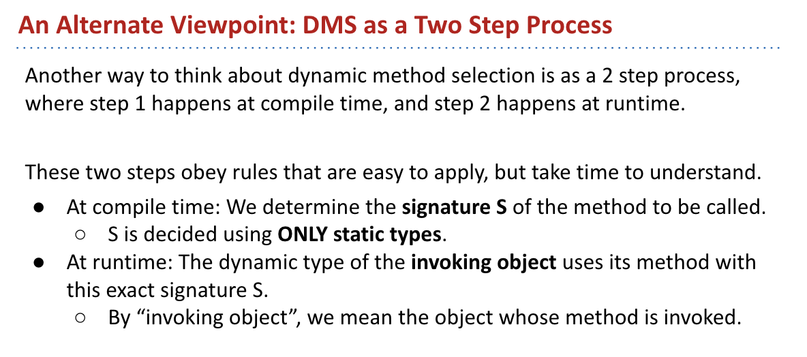

[toc]

# Resources
[web-2021](https://sp21.datastructur.es/)
[text-book_2021](https://joshhug.gitbooks.io/hug61b/content/)
[web-2024](https://sp24.datastructur.es/)
[text-book_2024](https://cs61b-2.gitbook.io/cs61b-textbook)

This note for what?
* 提炼知识点，讲义上有的，过分重复的，取消
* 把数据结构总结好，快速到位
看完视频，一天内完成笔记。
write code important!!!!
# Phase 1: Programming Intensive Introduction to Java
Lec1 to Lec11
**Philosophy**
A sense of abstraction ,why make sense?


## Lecture1. Intro,Hello World Java

### Summary
[offical summary](https://sp21.datastructur.es/materials/lectures/lec1/lec1.html) 
* Intro 
* Course Logistics
* Hello world

### 61B Overview  
* Writing code that runs efficiently
* Writing code efficiently

* TMWLO 
  * small minority to learn: **Intro to new material**
  * vast majority: 
    * **Theory**: discussion,study guide,theory homework
    * **Programming,Tool Usage,Problem Decompostion**: Lab,coding project
    * **Design**: Project
* Course Structure
  * Phase1: Programming Intensive Intro to Java
  * Phase2: Course Structure
  * Phase3: Algorithms and Software Engineering

* Weekly Surveys and Study Guides
  * Study guides for each lecture.

### Intro to Java
* Java and Object Orientation
* Java and Static Typing
* Reflection on Static Typing


## Lecture2. Defining and Using Classes

### Summary
[offical summary](https://sp21.datastructur.es/materials/lectures/lec2/lec2.html)
* Compilation
* Defining and Instantiating Classes
* A Closer Look at Static
  
### Compilation
compile the ``.java`` to ``.class``,which has been type checked

### Defining and Instantiating Classes 
* Object instantiation
  * Classes can contains function and data
  * Classes can be instantiated as objects
* Defining a Typical Class(Terminology)
  * Instance variable
  * Constructor
  * Non-static method__aka. Instance Method
* Instantiating a Class and Terminlology
  * Declaration
  * Instantiation
  * Instantiation and Assignment
  * Declaration, Instantiation and Assignment
  * Invocation
### Static vs. Non-static
* key difference
  * Static invoked by the class name
  * Instance invoked using an instance name
  * Static method cannot access instance variables
* *** Why static Methods? ***
对数据对象的属性命名
something not only is class, but general enough not to be instantiated
* Static vs. Non-static

### Managing Complexity with Helper Methods
* Managing Complexity with Classes and Static Methods 
  * Why use classes and static
    * The reason: To take choices away from the programmer.
      * Fewer choices means fewer ways to do things.
      * Fewer ways to do things often means *less complexity*.

* *** Managing Complexity More Generally ***
IMO,a good foundational computer science course should primarily teach you to properly manage complexity.

  * helper methods
    * Using helper methods lets you formalize the decomposition of large problems into small ones.
    * By focusing mental effort on a single task, there’s less room to make mistakes.


## Lecture3 Testing
### Summary
[offical-summary](https://sp21.datastructur.es/materials/lectures/lec7/lec7)
* A Simple JUnit test
* Testing Philosophty
* Selection Sort
* Simpler JUnit Tests

In the real world, programmers believe their code works because of tests they write themselves.
how to build a program? test...

### Ad Hoc Testing vs. JUnit
* Ad-Hoc Testing is Tedious
* JUnit: A library for Making Testing Easier
  * Syntax 1: ``org.junit.Assert.assertEquals(expected, actual)``
    * Test the expected and output the massages
  * Syntax 2: 
    * Anotate each test with ``@org.junit.Test``
    * Change all test methods to non-static...
    * Use a JUnit runner to run all tests and tabulate results
      * IntelliJ provides a default runner/renderer. OK to delete main.
  * Syntax 3: To avoid this we'll start every test file with:
    * ```java
      import org.junit.Test;
      import static org.junit.Assert.*;
      ```
### Testing Philosophy
* Correctness Tool 1: Autograde
  * Autograder Driven Development(ADD)
* Correctness Tool 2: Unit Tests
  * tests for every unit
  * [Test-Driven Develpment](https://ryantablada.com/red-green-refactor---a-tdd-fairytale/)
* Correctness Tool 3: Integration Testing


**learning**
Junit的具体用法；SFTW


## Lecture 4:References,Recursion,and Lists
* Primitive Types
* Reference Types
* Linked Data Structure

Java中基础类型与class的联系：从0、1建立逻辑的世界；其中总需要更高一级的抽象

### The Golden Rule: Summary
* There are 9 types of variables in Java:
  * 8 primitive types (byte, short, int, long, float, double, boolean, char).
  * The 9th type is references to Objects (an arrow). References may be null.
* In box-and-pointer notation, each variable is drawn as a labeled box and values are shown in the box. 
* The golden rule:
  * ``b = a`` copies the bits from a into b.
  * passing parameters copies the bits

### Note
``is`` in python equivalent to ``==`` in Java
  * check the memory addresses
``==`` in python equivalent to ``.equals`` in Java

### Primitve Types
* bits
* declaring a variable
* Simplified Box Notation
  * Instead of writing memory box contents in binary, we’ll write them in human readable symbols.

### Reference Types
* Reference Types
  * There are 8 primitive types in Java: byte, short, int, long, float, double, boolean, char
  * Everything else, including arrays, is a reference type.
* Class Instantiations
  * Java first allocates a box of bits for each instance variable of the class and fills them with a default value (e.g. 0, null).
  * The constructor then usually fills every such box with some other value.
* Reference Type Variable Declarations
  * Java allocates exactly a box of size 64 bits, no matter what type of object.
  * These bits can be either set to:
    * Null (all zeros).
    * The 64 bit “address” of a specific instance of that class (returned by new)
  * The address: All zero refer to 'null', No zero refer to arrows

* Instantitation of Arrays
  * Declaration and Instantiation of Arrays
  * Assignment of Arrays

* IntList and Linked Data Structure

## Lecture 5: SLLists, Nested Classes, Sentinel Nodes 
### Summary
[offical-summary](https://sp21.datastructur.es/materials/lectures/lec4/lec4)

* From Intlist to SLList
  * The private keyword
  * Nested classes
  * Recursive private helper methods
  * Caching
  * Sentinel nodes

### From IntList to SLList
* Improvement 1: Rebranding and Culling
* Improvement 2: Bureaucracy
  * ```java
      public class SLList {
      public IntNode first;

      public SLList(int x) {
      first = new IntNode(x, null);
      }
      }

    ```
### Public vs. Private Nested Classes
* Implement 3: Access Control
  * Use the ``private`` 
* Implement 4: Nested Class
  * Why Nested Class ? : 
* Static Nested Classes
  * If the nested class never uses any instance variables or methods of the outer class, declare it static.
    * Static classes cannot access outer class’s instance variables or methods
### ``addLast()`` and ``size()``
* Private Recursive Helper Methods
  * To implement a recursive method in a class that is not itself recursive
    * Creat a private recursive helper method 
    * Have the public method call the private recursive helper method.
* Improvement 5: Fast ``size()``
  * caches the size of the list
* Improvement 6a : Representing the Empty List
### Sentinel Nodes
* Tip For Being a Good Programmer: Keep Code Simple
* Improvement 6b: Representing the Empty List Using a Sentinel

* **Invariants**
An invariant is a condition that is guaranteed to be true during code execution (assuming there are no bugs in your code).
  * Invariants make it easier to reason about code:
    * Can assume they are true to simplify code (e.g. addLast doesn’t need to worry about nulls).
    * Must ensure that methods preserve invariants.


Intlist :基础节点与其他；当添加元素时，永远在接触底端 $\rightarrow$ 细节的思考
SLLists:来一个数组！！！

利用抽象来思考问题：rules—————(public\private)

---(Nested Classes)

抽象的思考：结果 而非 过程


## Lecture 6: DLLists,Arrays
### Summary
[offical summary]
* Doubly Linked Lists
* Generic SLLists
* Arrays
* Arrays vs. Classes


对世界的表述，多方面的思考
**from SLList $\rightarrow$ DLList**
对单个item的操作，变为对整体的操作的整合：
SLList的addList()太慢
1. add a sential for last
   * Remove() will be slow!!!
     * Requires setting 9’s next pointer to null, and point last at the 9 node.

2. DLList
   取消了单个item的特殊地位：
   * Non-obvious fact: This approach has an annoying special case: last sometimes points at the sentinel, and sometimes points at a ‘real’ node. 
   * 用节点来强调它们之间的关系：


### Generic Lists
**泛型**

**Array**see the textbook


## Lecture 7: Arrays and Resizing vs. SLists

[reading](https://joshhug.gitbooks.io/hug61b/content/chap2/chap25.html)
* A Last Look at Linked Lists
* Naive Arrays Lists
* Resizing Arrays
* Gerneric ALists
* Obscurantism in Java

61C Preview :Ultra fast random access results from the fact that memory boxes are the same size(in bits)
Array 是设定抽象是固有的性质，将DList转化为AList，节省时间——抽象的穿刺
抓住不变量(Invariants)
:


**Generic ALists**


**Obscurantism in Java**


## Lecture 8: Interface and Implementation Interitance
[reading](https://joshhug.gitbooks.io/hug61b/content/chap4/chap41.html)
* The Problem
* Hypernyms,Hyponyms, and Interface Inheritance
* Implementation Inheritance :Default Methods
* Implementation Inheritance :Extends
  
抽象的层次：
将SLList与AList整合怎么搞
1. overload
   
2. Interface___overriding
   
   
   

**Default Methods**


**Static and Dynamic Type, Dynamic Method Selection**
Interface与基本类型的技术化关联：


```
public static void main(String[] args) {
   List61B<String> someList = new SLList<String>();	
      someList.addFirst("elk");
      // someList can contain the address of new SLList...
}
``` 


 

## Lecture 9: Extends,Casting,HigherOrderFunction
[reading](https://joshhug.gitbooks.io/hug61b/content/chap4/chap42.html)
* Implementation Inheritance :Extends
* Encapulation
* Casting
* Higher Order Functions in Java

利用抽象，区分了层级关系(Abstraction Barriers)：``is-a`` or ``has-a``


* Extend
  * Type Check
  * Casting
  * Constructores are not Inherited
  * The Object of class :[what inherited](https://docs.oracle.com/javase/9/docs/api/java/lang/Object.html)


## Lecture 10: Subtype Polymorphism vs.HoFs
[reading](https://joshhug.gitbooks.io/hug61b/content/chap4/chap43.html)
* Dynamic Methods Selection Puzzle
* Subtype Polymorphism vs. Explicit HoFs
* Application 1:Comparables
* Application 2:Comparators

### Comparables
We can create an interface (``Comparable``)that guarantees that any implementing class, like Dog, contains a comparison method, which we'll call ``compareTo``, in order to solve ``>`` for a more generic compire.

We'll take advantage of an interface that already exists called Comparable. Comparable is already defined by Java and is used by countless libraries. 

### Comparator
What if we'd like to sort Dogs in a different way than their natural ordering, such as by alphabetical order of their name? 
```java   
public interface Comparator<T> {
    int compare(T o1, T o2);
} 
``` 
To do this, we can simply defer to String's already defined compareTo method. 

### Summary
To summarize, interfaces in Java provide us with the ability to make callbacks. Sometimes, a function needs the help of another function that might not have been written yet (e.g. max needs compareTo). A callback function is the helping function (in the scenario, compareTo). In some languages, this is accomplished using explicit function passing; in Java, we wrap the needed function in an interface.


## Lecture 11: Exception,Iterators,Object Methods
* Lists and Sets
* Exceptions
* Iteration
* toString and Equals

```java
Set<String> s = new HashSet<>();
...
for(String city : s ){
  ....
}
// the code translates to :

Set<String> s = new HashSet<>();
...
Iterator<String> seer = s.iterator();
while (seer.hasNext()){
  String city = seer.next();
  ...
}

```

### Object Methods
``equals()`` and ``==`` have different behaviors in Java. ``==`` Checks if two objects are actually the same object in memory. Remember, pass-by-value! ``==`` checks if two boxes hold the same thing. For primitives, this means checking if the values are equal. For objects, this means checking if the address/pointer is equal.


