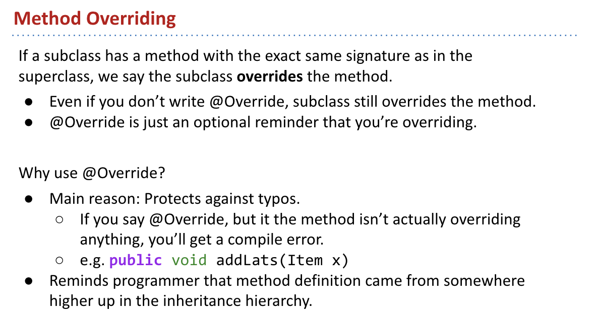
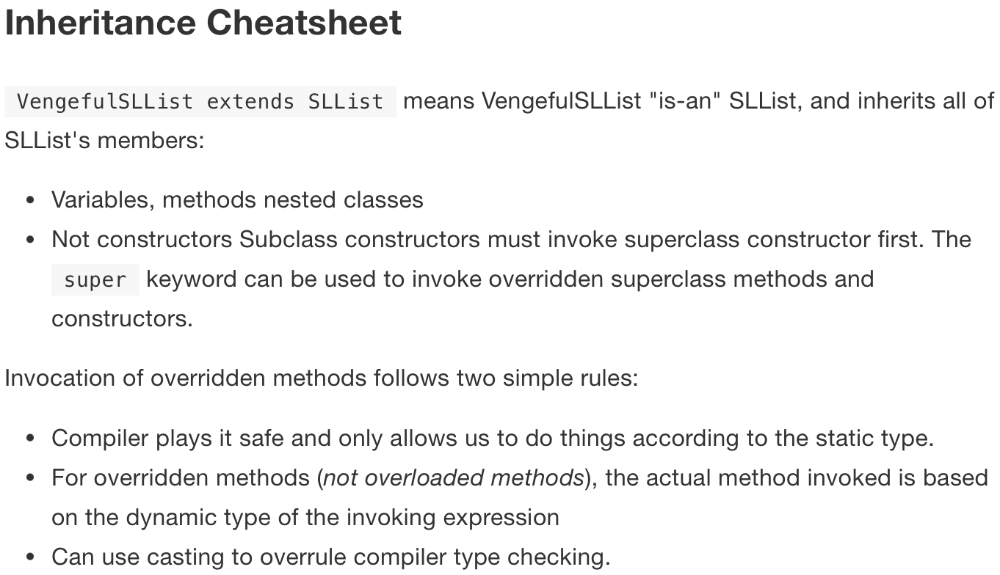

[toc]

## for_the_java_learning 
With_Java程序设计—基础、编程抽象与算法策略(Programming Abstractions in Java)

This note for what?
* 提炼知识点，讲义上有的，过分重复的，取消
* 把数据结构总结好，快速到位
看完视频，一天内完成笔记。
write code important!!!!
# Phase 1: Programming Intensive Introduction to Java
[reading](https://joshhug.gitbooks.io/hug61b/content/chap1/chap11.html)
Weeks:1-4  
Lec1 to Lec11
**Philosophy**
A sense of abstraction ,why make sense?
## Lecture1. Intro,Hello World Java
*** first ***
1. All code in Java must be part of a class.
2. We delimit the beginning and end of segments of codes with `{}`
3. All statements in Java must end in a semi-colon.
4. For code to run we need `public static void main()`

*** second ***
1. Before Java varibles can be used,they must be declared.
2. Java variables must have a specific type.
3. Java variables types can never changes.
4. In Java ,types are verified before the code runs! If there are types issues,the code WILL NOT COMPILE

*** Third ***
1. To declare a function in Java ,use "pubilc static"(for today)
2. All parameters of a function must have a type, and the function itself must have a return type.
3. All functions must be part of a class. In programming Language terminology, a function that is part of a class is called a "method",so all functions in Java are methods.


## Lecture2. Defining and Using Classes
[reading](https://joshhug.gitbooks.io/hug61b/content/chap1/chap12.html)
* Compilation
* Defining and Instantiating Classes
* A Closer Look at Static
  


*** Defining and Instantiating Classes ***

DogLauncher :a test drive class

Object instantiation


Static vs. Non-static
static method or static variables ,they cannot access my instance variables. 

*** Why static Methods? ***

为什么有static？对数据对象的属性命名。
```
pubilc static Dog maxDog(Dog d1,Dog d2){
    if(d1.weightInPounds > d2.weightInPounds){
    return d1;
    }
}
return d2;
--------------
public Dog maxDog(Dog d2){
    if(this.weightInPounds>d2.weightInPounds){
        return this;
    }
    return d2;
}
  

```


Managing Complexity with Helper Methods
Some obvious questions arise:
* Why does Java force us to use classes?
* Why have static methods at all?

The reason: To take choices away from the programmer.
* Fewer choices means fewer ways to do things.
  * Example: Declaring a method static means you can’t use any instance variables in that method.
* Fewer ways to do things often means *less complexity*.

*** Managing Complexity More Generally ***
IMO,a good foundational computer science course should primarily teach you to properly manage complexity.
* This philosophy drives nearly all aspects of this 61B’s design.


Let’s cover one important idea that you’ll want to be using all throughout the course: helper methods.
* Using helper methods lets you formalize the decomposition of large problems into small ones.
* By focusing mental effort on a single task, there’s less room to make mistakes.


## Lecture3 Testing
[reading](https://joshhug.gitbooks.io/hug61b/content/chap3/chap31.html)
[code](../../Programming_Abstractions_in_Java/src/main/java/edu/cs61b/hw_practice/)
* A Simple JUnit test
* Testing Philosophty
* Selection Sort
* Simpler JUnit Tests

In the real world, programmers believe their code works because of tests they write themselves.
how to build a program? test...


### Testing Philosophy


[perspector](http://ryantablada.com/post/red-green-refactor---a-tdd-fairytale)


**Parting Toughts**
* JUnit makes testing easy.
* You should write tests.
  * But not too many.
  * Only when they might be useful!
  * Write tests first when it feels appropriate [I do this a lot].
  * Lab 3, Project 1B, and Project 2 will give you practice!
  * Most of the class won’t require writing lots of tests (to save you time).

* Some people really like TDD. Feel free to use it in 61B.

**learning**
Junit的具体用法看讲义；


## Lecture 4:References,Recursion,and Lists

[read](https://joshhug.gitbooks.io/hug61b/content/chap2/chap21.html)

* Primitive Types
* Reference Types
* Linked Data Structure

Java中基础类型与class的联系：从0、1建立逻辑的世界；其中总需要更高一级的抽象


The tech between basic types and reference types:**the Golden Rule of Equals**:


**Instantiation of Arrays**
[code](../../Programming_Abstractions_in_Java/src/main/java/edu/cs61b/lecture/Phrase1/Intlist.java)


## Lecture 5: References, Recursion, and Lists

[reading](https://joshhug.gitbooks.io/hug61b/content/chap2/chap22.html)
[code](../../Programming_Abstractions_in_Java/src/main/java/edu/cs61b/hw_practice/)

* From Intlist to SLList
  * The private keyword
  * Nested classes
  * Recursive private helper methods
  * Catching
  * Sentinel nodes

Intlist :基础节点与其他；当添加元素时，永远在接触底端 $\rightarrow$ 细节的思考
SLLists:来一个数组！！！


利用抽象来思考问题：rules—————(public\private)


---(Nested Classes)


抽象的思考：结果 而非 过程


## Lecture 6: DLLists,Arrays

* Doubly Linked Lists
* Generic SLLists
* Arrays
* Arrays vs. Classes

[reading_DLLists](https://joshhug.gitbooks.io/hug61b/content/chap2/chap23.html)
[reading_Arrays](https://joshhug.gitbooks.io/hug61b/content/chap2/chap24.html)

对世界的表述，多方面的思考
**from SLList $\rightarrow$ DLList**
对单个item的操作，变为对整体的操作的整合：
SLList的addList()太慢
1. add a sential for last
   * Remove() will be slow!!!
     * Requires setting 9’s next pointer to null, and point last at the 9 node.

2. DLList
   
   取消了单个item的特殊地位：
   * Non-obvious fact: This approach has an annoying special case: last sometimes points at the sentinel, and sometimes points at a ‘real’ node. 
   * 用节点来强调它们之间的关系：
      

]

### Generic Lists
**泛型**


**Array**see the textbook


## Lecture 7: Arrays and Resizing vs. SLists

[reading](https://joshhug.gitbooks.io/hug61b/content/chap2/chap25.html)
* A Last Look at Linked Lists
* Naive Arrays Lists
* Resizing Arrays
* Gerneric ALists
* Obscurantism in Java

61C Preview :Ultra fast random access results from the fact that memory boxes are the same size(in bits)
Array 是设定抽象是固有的性质，将DList转化为AList，节省时间——抽象的穿刺
抓住不变量(Invariants)
:


**Generic ALists**


**Obscurantism in Java**


## Lecture 8: Interface and Implementation Interitance
[reading](https://joshhug.gitbooks.io/hug61b/content/chap4/chap41.html)
* The Problem
* Hypernyms,Hyponyms, and Interface Inheritance
* Implementation Inheritance :Default Methods
* Implementation Inheritance :Extends
  
抽象的层次：
将SLList与AList整合怎么搞
1. overload
   
2. Interface___overriding
   
   
   

**Default Methods**


**Static and Dynamic Type, Dynamic Method Selection**
Interface与基本类型的技术化关联：

```java
public static void main(String[] args) {
   List61B<String> someList = new SLList<String>();	
      someList.addFirst("elk");
      // someList can contain the address of new SLList...
}
```

 

## Lecture 9: Extends,Casting,HigherOrderFunction
[reading](https://joshhug.gitbooks.io/hug61b/content/chap4/chap42.html)
* Implementation Inheritance :Extends
* Encapulation
* Casting
* Higher Order Functions in Java

利用抽象，区分了层级关系(Abstraction Barriers)：``is-a`` or ``has-a``


* Extend
  * Type Check
  * Casting
  * Constructores are not Inherited
  * The Object of class :[what inherited](https://docs.oracle.com/javase/9/docs/api/java/lang/Object.html)


## Lecture 10: Subtype Polymorphism vs.HoFs
[reading](https://joshhug.gitbooks.io/hug61b/content/chap4/chap43.html)
* Dynamic Methods Selection Puzzle
* Subtype Polymorphism vs. Explicit HoFs
* Application 1:Comparables
* Application 2:Comparators

### Comparables
We can create an interface (``Comparable``)that guarantees that any implementing class, like Dog, contains a comparison method, which we'll call ``compareTo``, in order to solve ``>`` for a more generic compire.

We'll take advantage of an interface that already exists called Comparable. Comparable is already defined by Java and is used by countless libraries. 

### Comparator
What if we'd like to sort Dogs in a different way than their natural ordering, such as by alphabetical order of their name? 
```java   
public interface Comparator<T> {
    int compare(T o1, T o2);
} 
``` 
To do this, we can simply defer to String's already defined compareTo method. 

### Summary
To summarize, interfaces in Java provide us with the ability to make callbacks. Sometimes, a function needs the help of another function that might not have been written yet (e.g. max needs compareTo). A callback function is the helping function (in the scenario, compareTo). In some languages, this is accomplished using explicit function passing; in Java, we wrap the needed function in an interface.


## Lecture 11: Exception,Iterators,Object Methods
[reading](https://cs61b-2.gitbook.io/cs61b-textbook/12.-exceptions-iterators-object-methods)
* Lists and Sets
* Exceptions
* Iteration
* toString and Equals

```java
Set<String> s = new HashSet<>();
...
for(String city : s ){
  ....
}
// the code translates to :

Set<String> s = new HashSet<>();
...
Iterator<String> seer = s.iterator();
while (seer.hasNext()){
  String city = seer.next();
  ...
}

```
