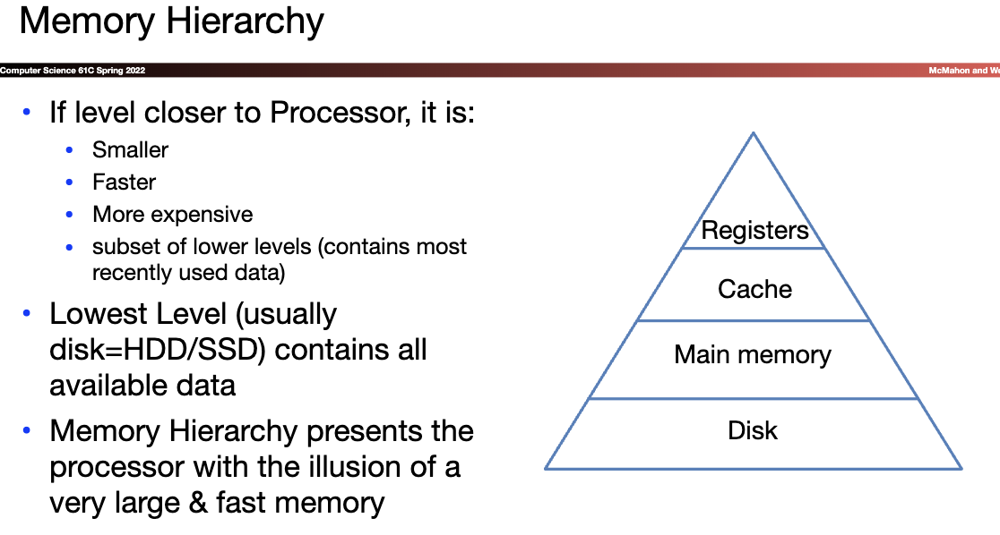

![toc]
## Lec_15_16_17 Caches 
*** help you update the most useful data quichly ***

**Taking Advantage of Locality**
* Temporal Locality
  * If a memory location is referenced then it will tend to be referenced again soon
  * $\rightarrow$Keep most recently accessed data items closer to the processor
* Spatial Locality
  * If a memory location is referenced, the locations with nearby addresses will tend to be referenced soon 
  * $\rightarrow$Move blocks consisting of contiguous words closer to the processor 

* Cache Hit
  * The data you were looking for is in the cache 
* Cache Miss 
  * The data you were looking for is not in the cache 
* Eviction 
  * Removing an entry from the cache
* Hit Rate
* Miss Rate
* Hit Time
* Miss penalty
* Cache line/block
* Line size/block size
* Capacity
* 

  
