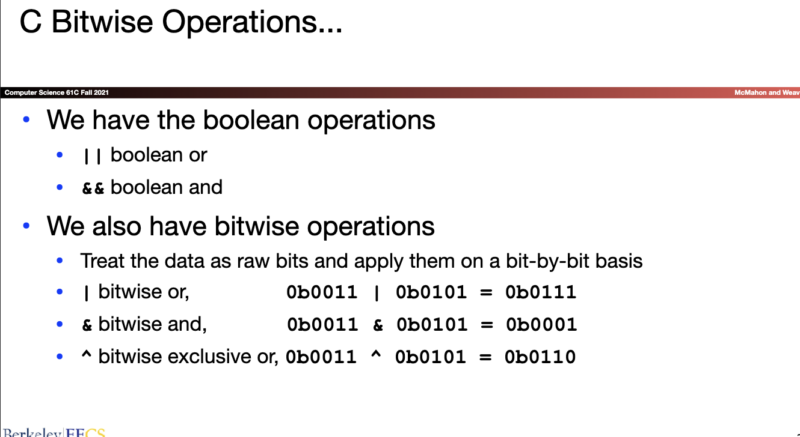
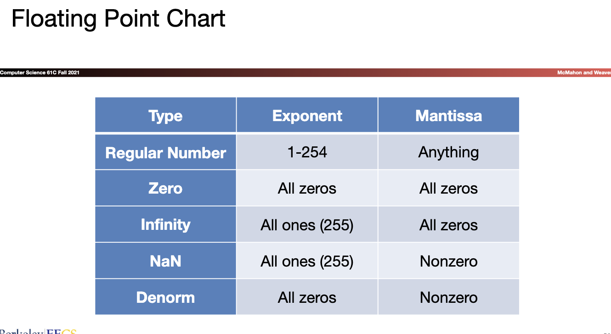

[TOC]
# Intro_to_C

## Lec_1
### Summary
* Binary, Decimal, Hex
* Sign and Magnitude
* One's Complement
* Two's Complement  
* Bias
* IEC Prefixes

Topic on numbers:
the use of Sign and Magnitude: Hard to achieve in hardware for computing
One's Complement: to form the negative numbers, flip the bits of the postive form of the number---The MSB represents the sign~~Still hava two zeros~~
Two's Complement: Flip the bits and add one


## Lec_2
* Computer Organization
* Compile vs. Interpret
* C vs Java

### Intro to C
**why C**: indelicated to the construction of Computer
### Compile vs. Interpret
* ***Compilation***
  * Advantages
    1. Excellent run-time performance: generally much faster than Python or Java for comparable code (because it optimizes for a given architecture)
      * But these days, a lot of performance is in libraries: Plenty of people do scientific computation in python!?!, because they have optimized libraries usually written in C and 99% of the execution takes place in the libraries
    2. Reasonable compilation time: only modified files are recompiled 
        * Generally handled by the Makefile or larger build system
  * Disadvantages
    1. Compiled files, including the executable, are architecture-specific, depending on processor type (e.g., MIPS vs. x86 vs. RISC-V) and the operating system (e.g., Windows vs. Linux vs. MacOS)
        * And even library versions under Linux.  Linux is so bad we came up with "containers", that effectively ship around whole miniature OS images just to run single programs


* C vs.Java
* Typed Variables in C
* **Specific Sized Numbers**
  * ``{u|}int{#}_t``
    * Whether unsigned
    * Integer
    * number of bits {8,16,32,64}
* Consts and Enums in C
* Tyed Functions in C
  * need to declare the return value before declare the function
  * need to declare the function before the use of function
* Structs in C
* C Syntax: main
  * When start a C program
    * C executable a.out is loaded into memory by operating system (OS) 
    * OS sets up stack, then calls into C runtime library, 
    * Runtime first initializes memory and other libraries, 
    * then calls your procedure named main()

* C Syntax : Variable Declaration
* C Syntax : Control Flow
* C Syntax : True or False


## Lec_3 Pointers, Arrays, Memory(basic idea)
### Conclusion
* Conclusion on Pointers
  * All data is in memory 
    * Each memory location has an address to use to refer to it and a value stored in it 
  * Pointer is a C version (abstraction) of a data address 
    * `*`“follows” a pointer to its value 
    * `&`  gets the address of a value 
  * C is an efficient language, but leaves safety to the programmer 
    * Variables not automatically initialized 
    * Use pointers with care: they are a common source of bugs in programs

* And In Conclusion
  * C has three main memory segments in which to allocate data: 
    * Static Data: Variables outside functions
    * Stack: Variables local to function 
    * Heap:  Objects explicitly malloc-ed/free-d. 
  * Heap data is biggest source of bugs in C code


 

### Pointers,Array
* Address vs. Value
* Pointers
  * An address refers to a particular location
  * Pointer: A variable that contains the address of a variable
* Types of Pointers
* NULL Pointers
* More C Pointer Dangers
#### Pointers and Structures
  ```c
  /* dot notation */
  int h = p1.x;
  p2.y = p1.y;


  /* arrow notation*/
  int h = paddr->x;
  int h = (*paddr).x;

  /* This works too, copies contents of p2 to p1 */
  p1 = p2 ;
  p1 = *paddr;
  ```
* Pointers in C
* Pointing to Different Size Objects
* ``sizeof()``operator
  * not function, a compile-time operation
* [Pointer Arithmetic](https://www.geeksforgeeks.org/cpp-pointer-arithmetic/)
  * Basic rule
  * *ptr++ Increment the pointer by 1 item then de-reference the memory location it had before incrementing
  * 

#### Structures
* Structures Revisited
* Plus also Unions
* C Arrays
* Array Name / Pointer Duality
  * Array variable is simply a 'pointer' to the first(0th) element
* Arrays and Pointers
  * ``a[i] == *(a + i)``
  * C Array are Very Primitve
    * the bounds unchecked and the length unknown
* C Strings
  * char string[] = "abc";
  * Last character is followed by 0 byte, written as 0 (the number) or '\0' as a character
* Use Defined Constants
* Arrays and Structures and Pointers
* Concise ``strlen()``
* Arguments in ``main``
  * ``int main(int argc, char *argv[])``
* Endianness

#### C Memory Management
***Program's address space contains 4 regions***:
* **stack**: local variables inside functions, grows downward
* **heap**:  space requested for dynamic data via ``malloc()`` resizes dynamically, grows upward
* **static data**: variables declared outside functions, does not grow or shrink. Loaded when program starts, can be 
modified
* **code**:loaded when program starts, does not change 0x0000 0000 hunk is reserved and unwriteable/unreadable so you crash on null pointer access 

* Where are variables Allocated
  * inside function;outside function
  * ``main()`` is treated like a function
* The Stack
  * stack frame : Return address,Arguments,Space for local variables
  * a contiguous blocks of memory
  * Stack Animation:LIFO data structure
* Managing the Heap
  * ``malloc()``
  * ``calloc()``
  * ``free()``
  * ``realloc()``


## Lec_4 :C Memory (Mis)Management
[lec-slide](../slide/lec04.pdf)
* Managing the Heap_(前置知识)
  * Strings...
    * And Constant Strings...
    * String & Character Function
    * Alignment, Packing, & Structures..
  * C unions
    * How to Use Unions...
  * Structure Layout In Memory
    * Alignment,Packing, & Structure...
  * Pointer Ninjitsu
    * Pointers to arrays of structures
    * Accessing that array...
    * Pointers to Functions
    * How C++ works...
* How are Malloc/Free implemented(核心问题)
  * Simple Slow Malloc Implementation
    * The Problem : Fragmentation
google Buddy memory allocation
  * Conservative Mark/Sweep --Garbage Collectors
    * Fragment & Pauses...
* The Problems: Fragmentation & Pauses...(重点问题)
  * Common Memory Problems: aka Common "Anti-patterns"
    * Failure To Free
      * Reflection on Memory Leaks
    * Writing off the end of arrays...
    * Returning Pointers into the Stack
    * Use After Free
    * Forgetting Realloc Can Move Data
    * Freeing the Wrong Stuff...
    * Double-Free


  
## Lec_5 Floating Point

