[TOC]
# Intro_to_C

## Lec_1
* What you need to know about this class  
* Thinking about Machine Structures 
* Great Ideas in Computer Architecture 
* Number Representation

数字的可能：
  * Binary,Decimal,Hex
  * Sign and Magnitude
  * One's Complement
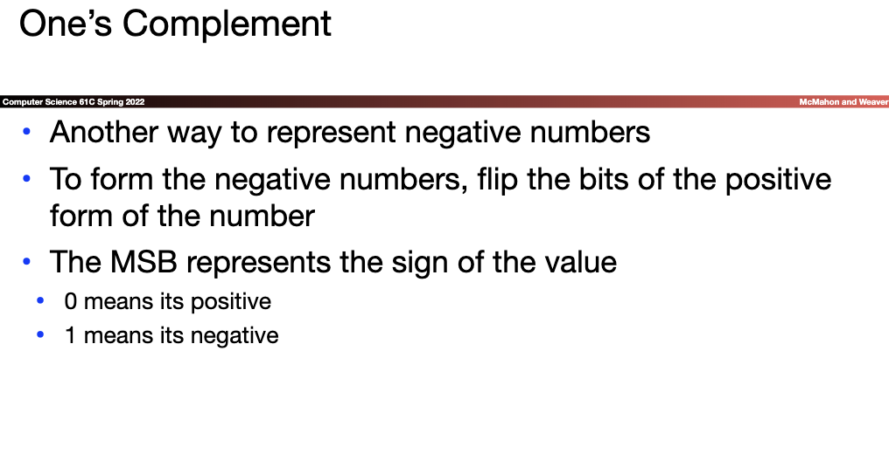
  * Two's Complement
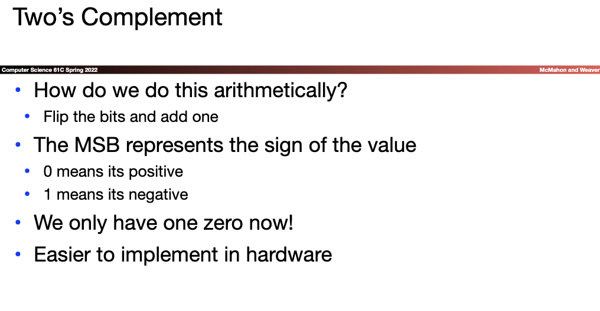
  * Bias 
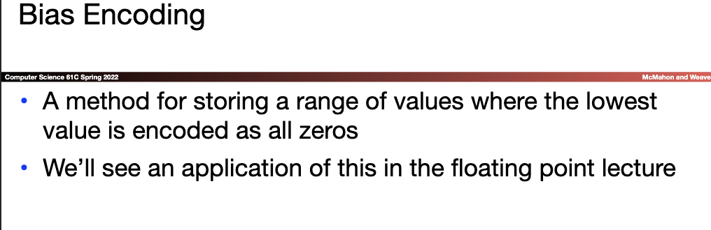
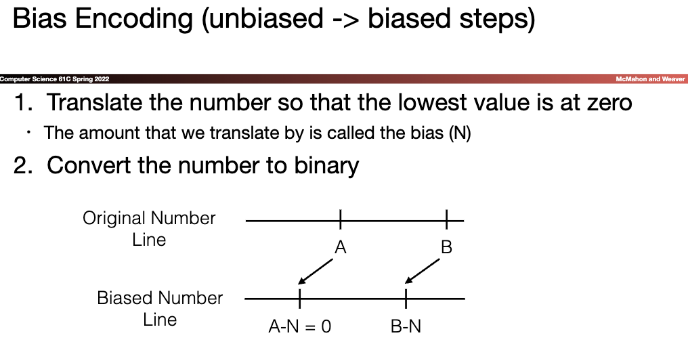

  * IEC Prefixes
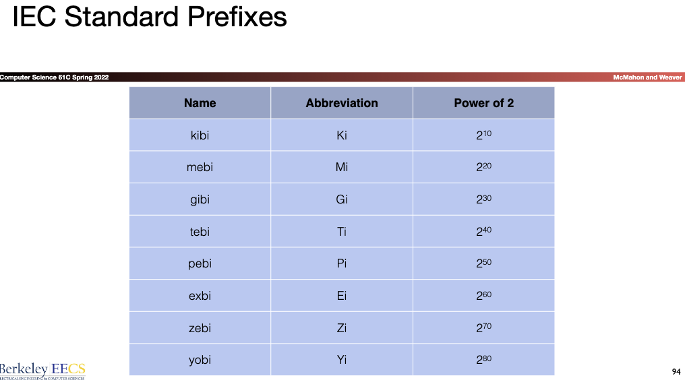


## Lec_2
* Computer Organization
* Compile vs. Interpret
* C vs Java
* Arrays and Pointers

***why C ***
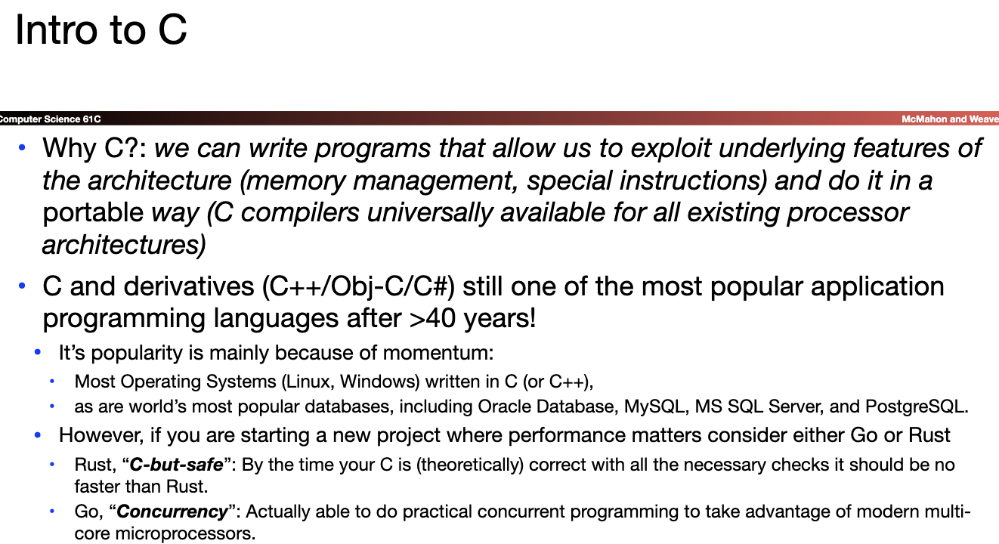

***Compilation***

  * Advantages
    1. Excellent run-time performance: generally much faster than Python or Java for comparable code (because it optimizes for a given architecture)
      * But these days, a lot of performance is in libraries: Plenty of people do scientific computation in python!?!, because they have optimized libraries usually written in C and 99% of the execution takes place in the libraries
    2. Reasonable compilation time: only modified files are recompiled 
        * Generally handled by the Makefile or larger build system
  * Disadvantages
    1. Compiled files, including the executable, are architecture-specific, depending on processor type (e.g., MIPS vs. x86 vs. RISC-V) and the operating system (e.g., Windows vs. Linux vs. MacOS)
        * And even library versions under Linux.  Linux is so bad we came up with "containers", that effectively ship around whole miniature OS images just to run single programs


*** Point Syntax**
* `int *p;`
  * Tells complier that ***variable p is address of*** an int
* `p = &y;`
  * Tells compiler to assign ***address of y*** to p
  * `&` called the "address operator" in this context
* ` z = *p;`
  * Tells compiler to assign the value at address in p to z 
  * called the “dereference operator” in this context 
* `*p = 64; `
  *  Tells the compiler to assign the value 64 into the memory location pointed to by p

***Pointers and Structures***
```c
typedef struct{
  int x;
  int y;
}Point;
```
`Point p1;`
`Point p2;`
`Point *paddr;`
```c
/* dot notation */
int h = p1.x;
p2.y = p1.y;


/* arrow notation*/
int h = paddr->x;
int h = (*paddr).x;

/* This works too, copies contents of p2 to p1 */
p1 = p2 ;
```

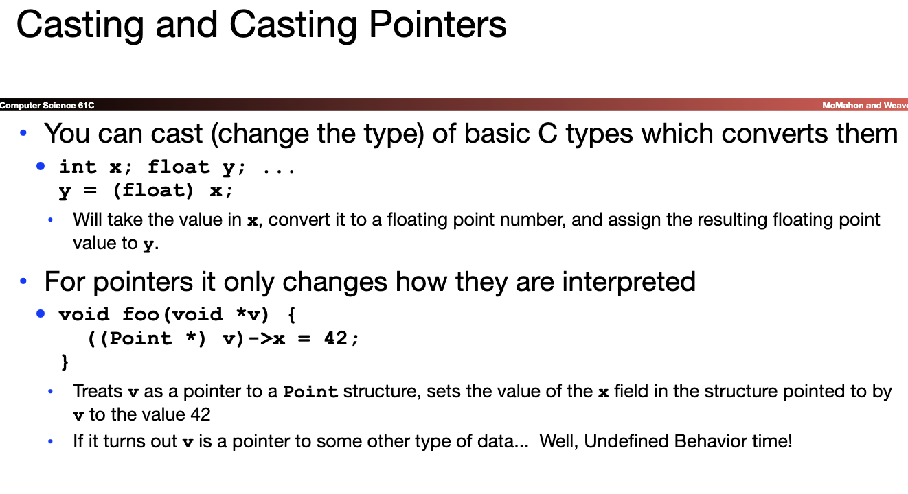

## Lec_3 Pointers, Arrays, Memory(basic idea)

* Conclusion on Pointers
  * All data is in memory 
    * Each memory location has an address to use to refer to it and a value stored in it 
  * Pointer is a C version (abstraction) of a data address 
    * `*`“follows” a pointer to its value 
    * &  gets the address of a value 
  * C is an efficient language, but leaves safety to the programmer 
    * Variables not automatically initialized 
    * Use pointers with care: they are a common source of bugs in programs

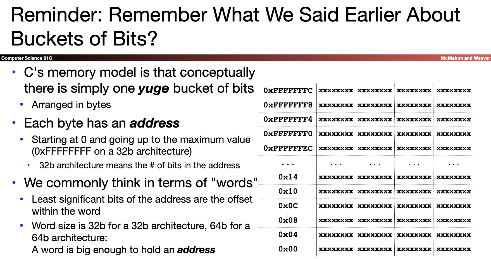

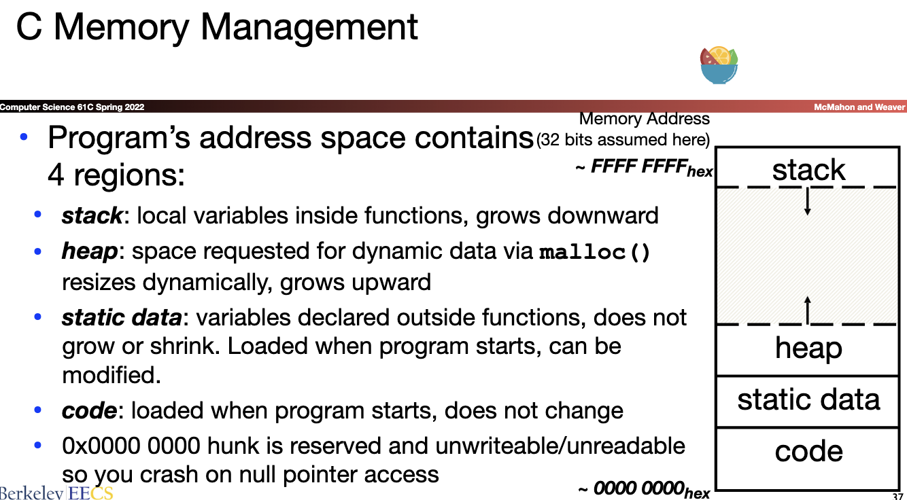

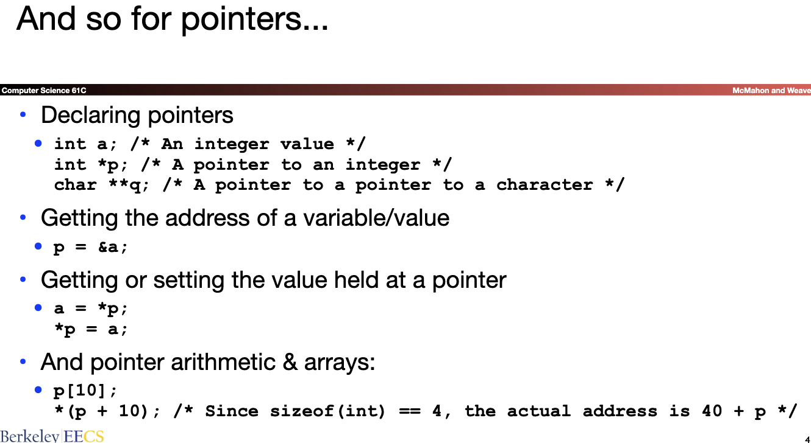

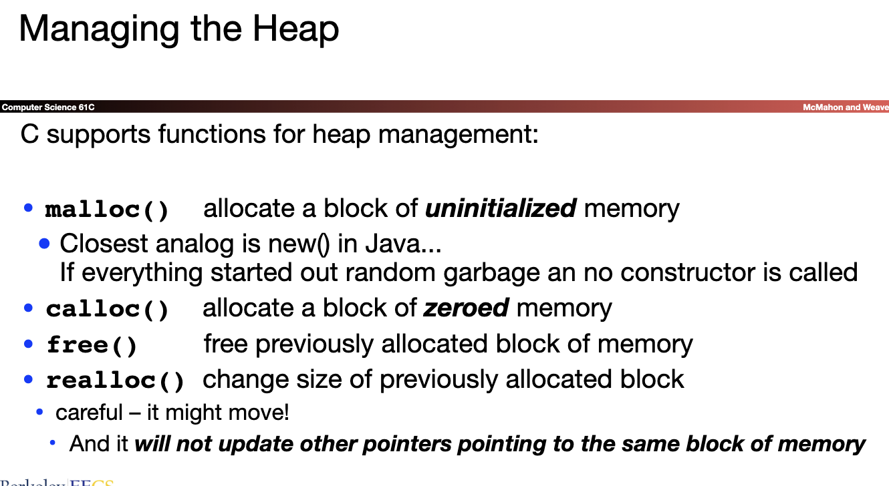
* And In Conclusion
  * C has three main memory segments in which to allocate data: 
    * Static Data: Variables outside functions
    * Stack: Variables local to function 
    * Heap:  Objects explicitly malloc-ed/free-d. 
  * Heap data is biggest source of bugs in C code


## Lec_4 :C Memory (Mis)Management
[lec-slide](../slide/lec04.pdf)
* Managing the Heap_(前置知识)
  * Strings...
    * And Constant Strings...
    * String & Character Function
    * Alignment, Packing, & Structures..
  * C unions
    * How to Use Unions...
  * Structure Layout In Memory
    * Alignment,Packing, & Structure...
  * Pointer Ninjitsu
    * Pointers to arrays of structures
    * Accessing that array...
    * Pointers to Functions
    * How C++ works...
* How are Malloc/Free implemented(核心问题)
  * Simple Slow Malloc Implementation
    * The Problem : Fragmentation
google Buddy memory allocation
  * Conservative Mark/Sweep --Garbage Collectors
    * Fragment & Pauses...
* The Problems: Fragmentation & Pauses...(重点问题)
  * Common Memory Problems: aka Common "Anti-patterns"
    * Failure To Free
      * Reflection on Memory Leaks
    * Writing off the end of arrays...
    * Returning Pointers into the Stack
    * Use After Free
    * Forgetting Realloc Can Move Data
    * Freeing the Wrong Stuff...
    * Double-Free


  
## Lec_5 Floating Point

