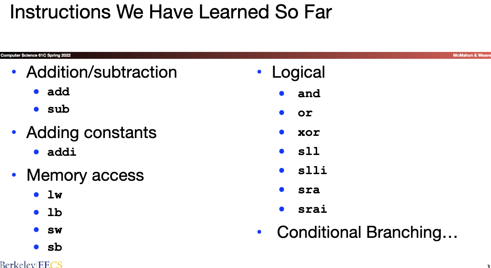
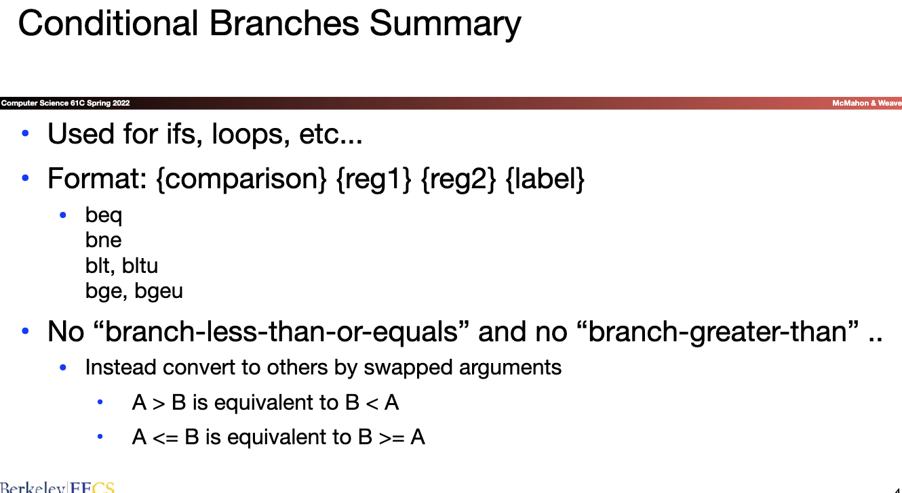
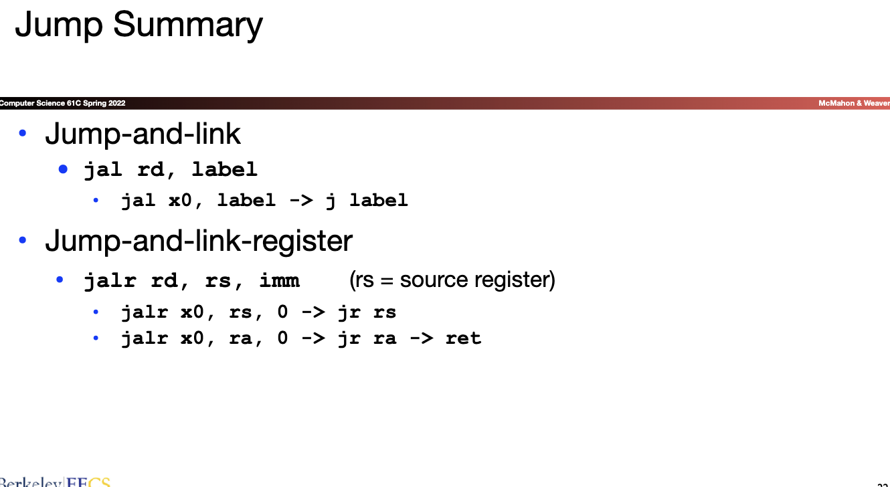
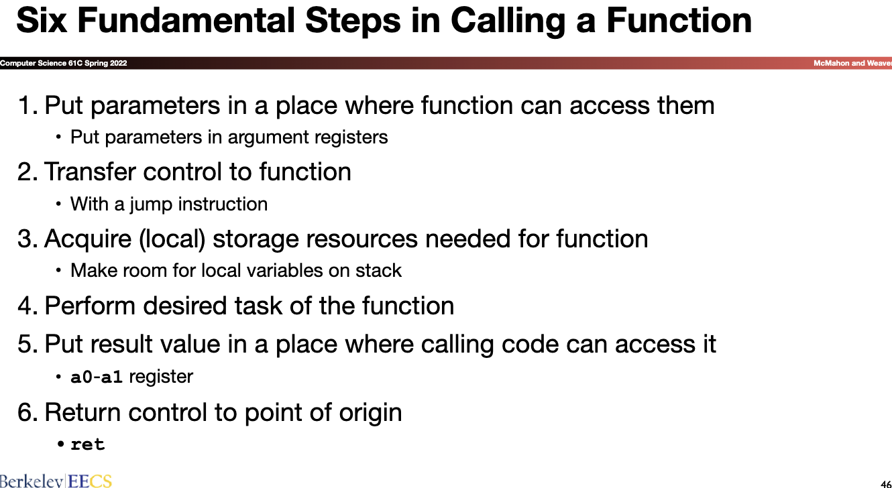
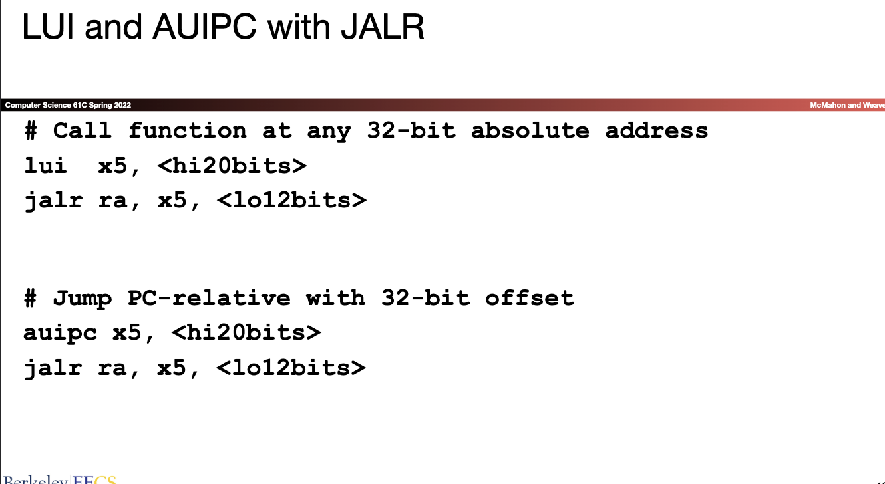
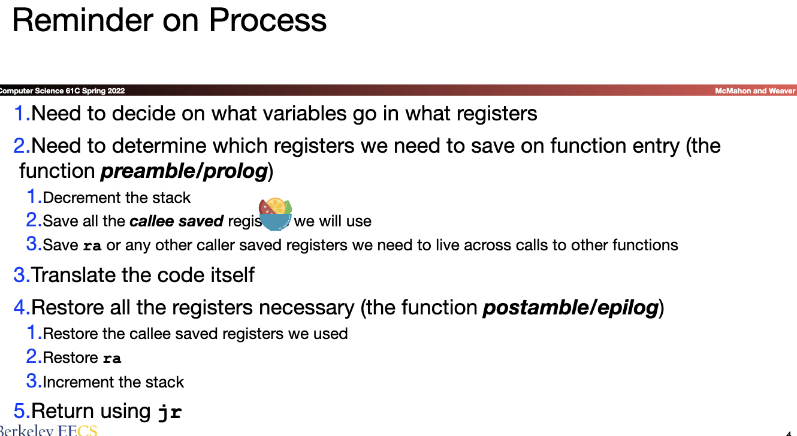
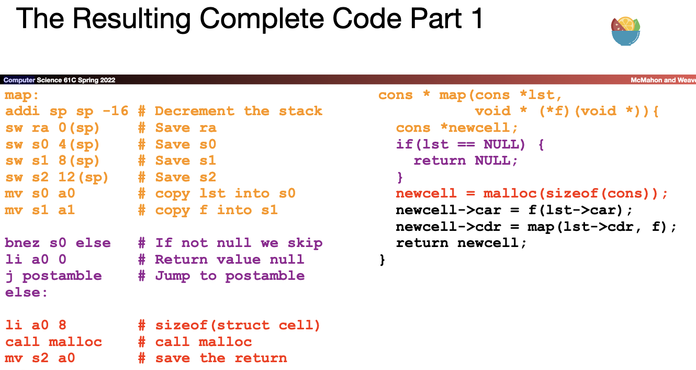
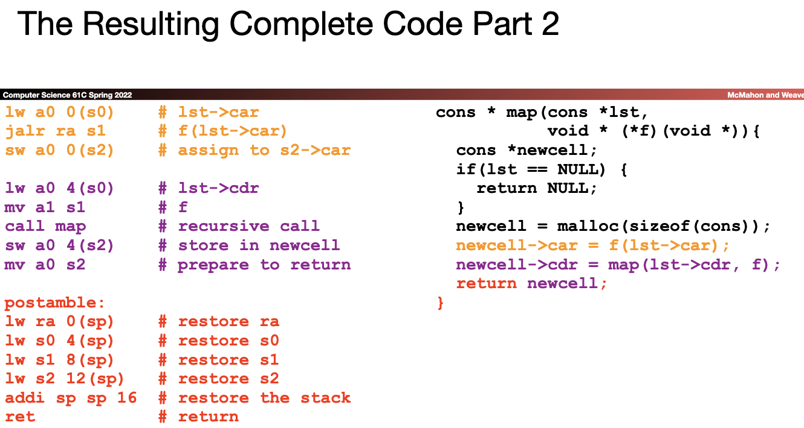

[TOC]
## Lec_6 Introduction to Assembly: RISC-V Instruction Set Architecture
[slide](../slide/lec06.pdf)
* ***Registers***
  * Unlike high-level languages like C or Java, assembly languages do not use variables
  * Instead, they use registers 
  * Small storage units that are located in the processor 
  * Operations are performed on registers
  * Registers are extremely fast due their location and size 
    * Unlike the memory which is located outside of the processor
* Structure
  * Registers are numbered from 0 to 31 
    * Referred to as x0 - x31 
    * We cannot choose the names of the registers 
  * x0 is a special register because it always holds the value 0 
  * Unlike variables in C, registers do not have a type 
    * The same register can be used to represent ints, chars, etc
  * Registers are 32 bits
  * Registers can hold any value
    * a pointer to the beginning of an array
    * a pointer to a string
    * an integer value
    * etc

* ***Loading vs Storing Sign Extension***

* Branch
  * if equal
  * if not equal
  * on less than
  * on greater than or equal
  

## Lec07_ More RISC-V Instructions and How to Implement Functions
[slide](../slide/lec07.pdf)

* Temporary registers 
  * Saved by caller 
* Saved Registers 
  * Saved by callee

### Lec08_ Great Ideas in Computer Architecture___RISC-V Instruction Formats

[slide](../slide/lec08.pdf)
RISC-V的manual看看

* ***I*** The base integer ISA is named “I” (prefixed by RV32 or RV64 depending on integer register width), and contains integer computational instructions, integer loads, integer stores, and control-flow instructions. 
* ***M*** The standard integer multiplication and division extension is named “M”, and adds instructions to multiply and divide values held in the integer registers. 
* ***A*** The standard atomic instruction extension, denoted by “A”, adds instructions that atomically read, modify, and write memory for inter-processor synchronization. 
* ***F*** The standard single-precision floating-point exten-sion, denoted by “F”, adds floating-point registers, single-precision computational instructions, and single-precision loads and stores.
* ***D*** The standard double-precision floating-point extension, denoted by “D”, expands the floating-point registers, and adds double-precision computational instructions, loads, and stores. 
* ***C*** The standard “C” compressed instruction extension provides narrower 16-bit forms of common instructions.

## Lec09_CALL__(Compiler/Assembler/Linker/Loader)

[slide](../slide/lec09.pdf)

* Translating a Complex Example 
* Interpretation vs Compilation 
* The CALL chain 
* Producing Machine Language
(nju-ics\csapp)

* ***Translating a Complex Example***

* The CALL chain