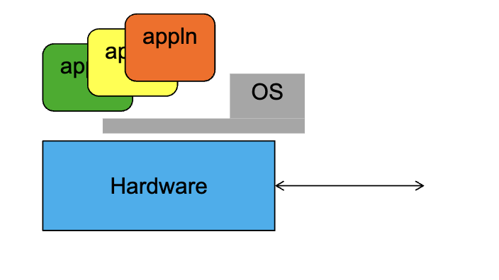

[toc]
# Lec1. What is an Operating System?
[slide](https://inst.eecs.berkeley.edu/~cs162/sp22/static/lectures/1-1up.pdf)

***Operating Systems are at the Heart of it All***
* Make the incredible advance in the underlying technology available to a 
rapidly evolving body of applications
  *  Provide **consistent abstractions** to applications, even on different hardware
  *  Manage **sharing of resources** among multiple applications

* The key building blocks:
  * Processes
  * Threads, Concurrency, Scheduling, Coordination
  * Address Spaces
  * Protection, Isolation, Sharing, Security
  * Communication, Protocols
  * Persistent storage, transactions, consistency, resilience
  * Interfaces to all devices

## One Definition of an Operating System
* Special layer of software that provides application software access to hardware resources
  * Convenient abstraction of complex hardware devices
  * Protected access to shared resources
  * Security and authentication
  * Communication

* Referee
  * Manage protection, isolation, and sharing of resources
    * Resource allocation and communication
* Illusionist
  * Provide clean, easy-to-use abstractions of physical resources
    * Infinite memory, dedicated machine
    * Higher level objects: files, users, messages
    * Masking limitations, virtualization
* Glue 
  * Common services
  * Storage, Window system, Networking
  * Sharing, Authorization
  * Look and feel

