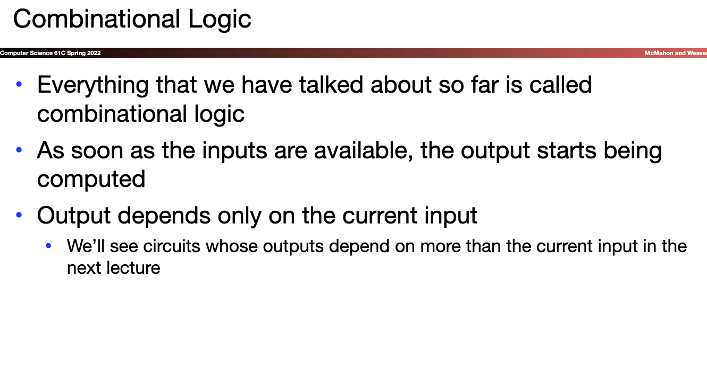
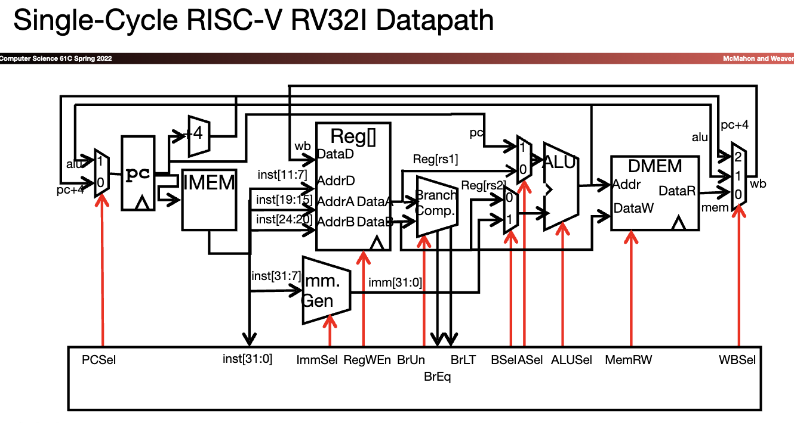
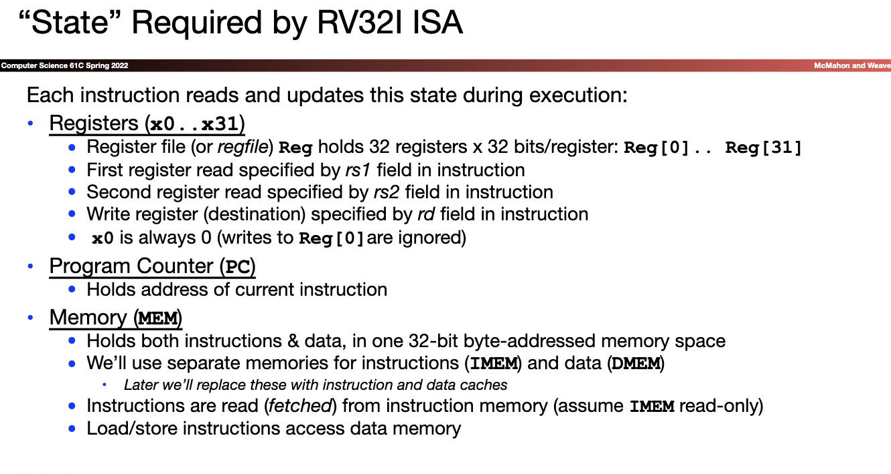
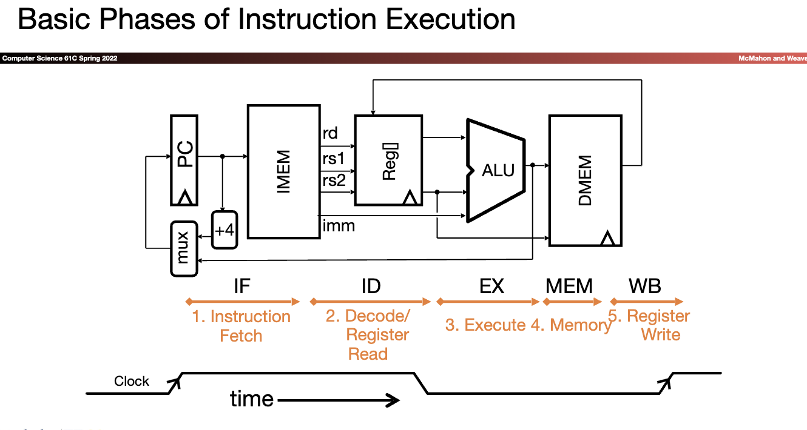
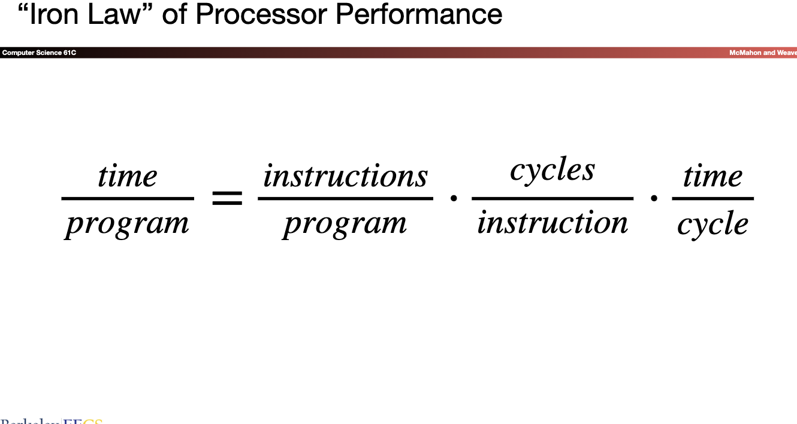
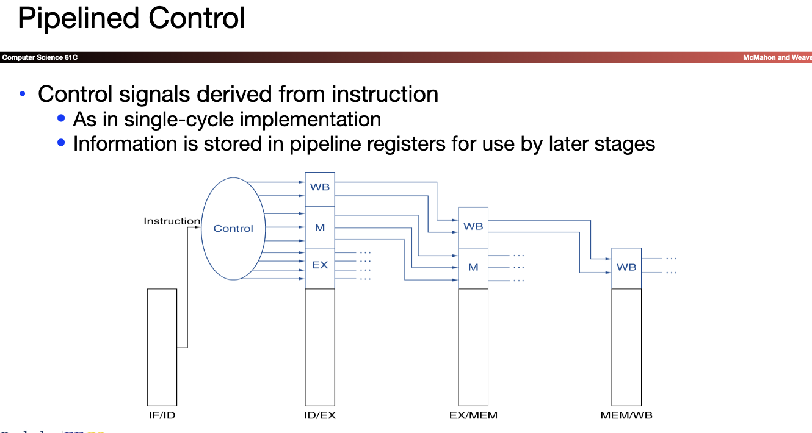
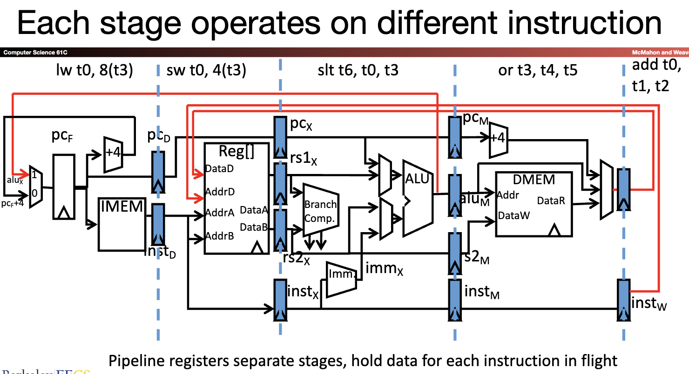
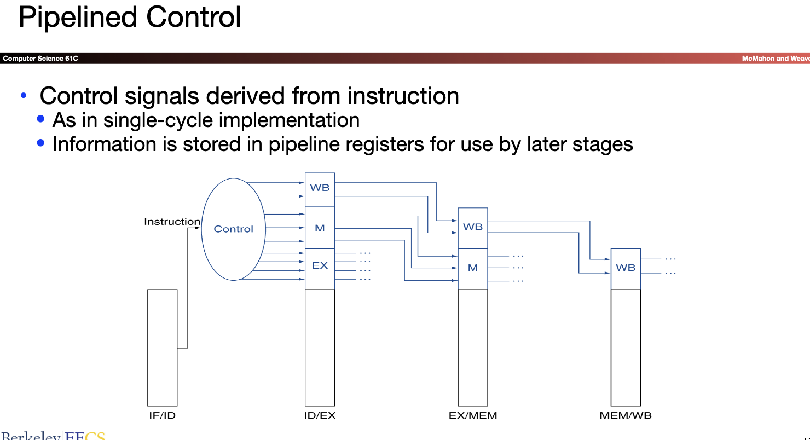
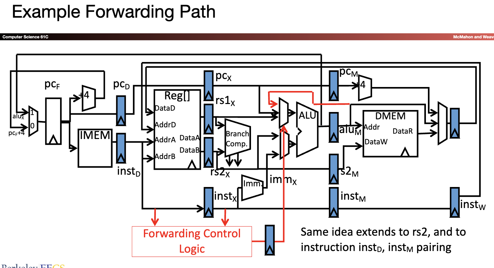

[TOC]

## Lec_10 Intro to Digital Systems

* Intro to Digital Systems
  * Digital
  * Analog

* Logic Gates
  * The building block of digital circuits
  * Perform logic operations
    * AND
    * OR
    * XOR
    * NOT
    * NAND
    * NOR
    * XNOR
* Boolean Algebra
  * A branch of algebra in which
    * The operands can only be 0 or 1
    * The basic operation are AND, OR, and NOT
    * (NAND, NOR, XOR, and XNOR can be created with a combination of the above operations)
  * Laws of Boolean Algebra
* How to Build an Adder
* Arithmetic Logic Unit
  * Carries out arithmetic and logical operations on integer binary numbers

## Lec_11 Synchronous Digital Systems

 A complete processor
* Consists of two pieces:
  * The **Datapath** that implements the computation
  * The **Control Logic** that looks at the instruction and tells the datapath what to do

## Lec_12 RISC-V Processor Design ---Part 1: The Datapath
* Universal datapath
  * Capable of executing all RISC-V instructions in one cycle each
  * datapath is the "union" of all the units used by all the instructions. Muxes provide the options.
  * Not all units (hardware) used by all instructions.
* 5 Phases of execution
  * IF,ID,EX,MEM,WB
  * Not all instructions are active in all phases
* Controller specifies how to execute instructions

## Lec_13 RISC-V Control & Operating Speed
* Completion of Single-Cycle RISC-V Datapath
* Controller
* Instruction Timing
* Performance Measures

* Introduction to Pipelining
* Pipelined RISC-V Datapath

* And in Conclusion
  * Controller 
    * Tells universal datapath how to execute each instruction 
  * Instruction timing 
    * Set by instruction complexity, architecture, technology 
    * Pipelining increases clock frequency, “instructions per second” 
      * But does not reduce time to complete instruction 
  * Performance measures 
    * Different measures depending on objective
      * Response time 
      * Jobs / second 
      * Energy per task

## Lec_14 Pipelining RISC-V
* RISC-V Pipeline
* Pipeline Control
* Hazards
  * Structural
  * Data
    * R-type instructions
    * Load
  * Control
* Superscalar processors

* Pipelined Control

* Hazards
  * Structure 
    * Two or more instrucbons in the pipeline compete for access to a single physical resource
    * Memory Access
  * Data
    * Register Access
      1. Stalling
      2. Forwarding (bypassing)
         1. the register we read is not 0
         2. the register is the output of perivous instruction
         * 右半边阴影被读取，左半边被写入 
         
    * Load Data Hazard
      * Stall
    * Control Hazards
      * Branch prediction
* Superscalar processors