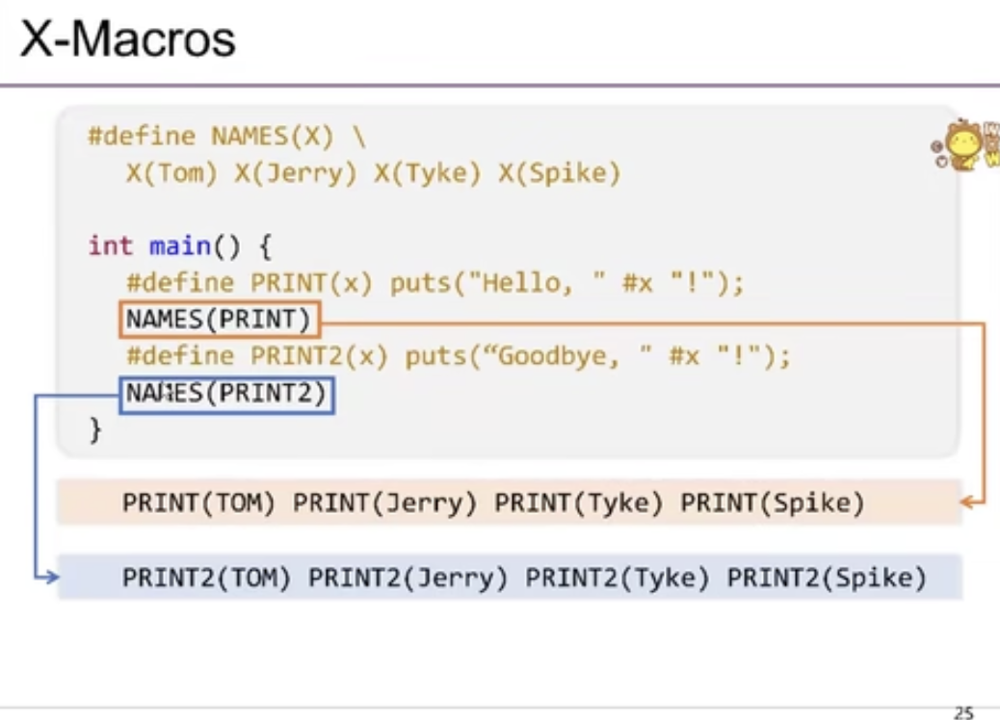

[class](https://space.bilibili.com/49964811/?spm_id_from=333.999.0.0)
## C语言拾遗之编程实践__W2
***本讲概述***
* 在IDE 里，为什么按一个键，就能编译运行？
  * 编译、链接
    * .c $\rightarrow$ 预编译 $\rightarrow$ .i  $\rightarrow$ 编译  $\rightarrow$ .s  $\rightarrow$ .o  $\rightarrow$ 链接  $\rightarrow$ a.out
  * 加载执行
    * ./a.out 
* 背后是通过调用命令行工具完成的
  * RTFM: gcc --help ; man gcc 
    * 控制行为的三个选项：-E , -S , -c
* 本次课程
  * 预热：编译、链接、加载到底做了什么？
  * RTFSC时需要关注的C语言特性

IDE 的一个键就是将约定进行不断的封装：计算机的学习就是认识到这种抽象，打开一个世界，在生活中不断创造。

`` echo $?``查看命令进行是否成功

``objdump -d ~``将二进制文件进行反汇编

### 进入C语言之前：预编译
#### ``#include``指令
* 什么是``#include``?
  就是将include后头文件包含的代码复制粘贴。 
** ``include <>``指令

找的地方不一样.... 
``gcc --verbose``多点细节
``gcc -I<path>``临时添加引入的文件

aa、bb都没有被定义，为NULL.NULL=NULL


``##`` 同样是粘贴的效果（将两个字符串连接在一起）
在PA中，需要读多个宏理解意思｜｜利用``-E``选项通过实现的作用来反向理解



利用预编译实现了C中进行语言的创造:更加灵活的方式进行编程


### 编译与链接


###  加载：进入C语言的世界

静态：**C代码的连续一段**总能对应到**一段连续的机器指令**
动态：**C代码执行的状态**总能对应到**机器的状态**
* 源代码视角
  * 函数、变量、指针……
* 机器指令视角
  * 寄存器、内存、地址……
两个视角的共同之处：**内存**

* 代码、变量 (源代码视角) = 地址 + 长度 (机器指令视角)
* (不太严谨地) 内存 = 代码 + 数据 + 堆栈
* 因此理解 C 程序执行最重要的就是**内存模型**

C语言中的所有东西都可以看成一段指针，一旦使用超过地址权限的方式使用指针:Segmentation fault


标准规定 C 程序从 main 开始执行
* (思考题：谁调用的 main？进程执行的第一条指令是什么？)
``int main(int argc, char *argv[]);``
* argc (argument count): 参数个数
* argv (argument vector): 参数列表 (NULL结束)
* ls -al
  * argc = 2 , argv =["ls","-al",NULL]


#### C Type System

``argc``为int type，4字节；
``char *argv[]`` $\rightarrow$ ``char ** argv`` $\rightarrow$ ``(char*)*argv``


**Summary**
* C语言**简单**(在可控时间成本里可以精通)
* C语言**通用**(大量系统是用C语言编写的)
* C语言实现对底层机器的精确控制(鸿蒙)
* recommend reading [The Art of Readable Code](https://www.oreilly.com/library/view/the-art-of/9781449318482/)


## C语言拾遗之编程实践——W3
* 本次课程
  * 怎样写代码才能从一个大型项目中存活下来？
    * 核心准则：编写可读代码
    * 两个例子：计数器、YEMU

### 核心准则：编写可读代码

#### 一个极端不可读的例子
[IOCCC'11 best self documenting program](https://www.ioccc.org/2011/hou/hou.c)
* 不可读 = 不可维护


#### 现实中可能遇到的例子
* 人类不可读版本(STFW:clockwise/spiral rule)
  * 终极使用顺时针螺旋法则的案例
```
void (*signal(int sig,void (*func)(int)))(int);
```
  * read: signal 是一个函数
    * 参数为int和一个指向函数的指针(函数参数为int，返回值为void) 
    * 返回值为一个指向函数的指针(参数为int，返回值为void)
* 人类可读版
  ```
  typedef void (*sighandler_t)(int);
  sighandler_t signal(int, sighandler_t);
  ```

#### 编写代码的准则：降低维护成本
  > Programs are meant to be read by humans and only incidentally for computers to execute. — D. E. Knuth
  
宏观
* 做好分解和解耦(现实世界也是这样管理复杂系统的)
  * ~~ PA是否允许添加额外的文件？~~ 

微观
* "不言自明"
  * 通过**阅读代码**能理解一段程序是做什么的(**implementation**)
* "不言自证"
  * 通过**阅读代码**能验证一段程序**implementation**与**specification**的一致性


### 例子：实现数字逻辑电路模拟器

代码的可维护性


**使用预编译：Pros and Cons**
* Pros
  * 增加/删除寄存器只要改很少的地方
  * 阻止一些编译错误
    * 忘记更新寄存器
    * 忘记打印寄存器
  * ”不言自明“
* Cons
  * 可读性变差(不太像C代码)
    * "不言自证"差一些
  * 给IDE解析带来一些困难

**更完整的实现：数码管显示**
[logisim.c](https://jyywiki.cn/pages/ICS/2020/demos/logisim.c) and [display.py](https://jyywiki.cn/pages/ICS/2020/demos/display.py)
* 你也可以考虑增加诸如开关、UART 等外设
* 原理无限接近大家数字电路课玩过的 FPGA

### 例子：实现YEMU全系统模拟器

整个计算机系统就是一个大的状态机，CPU的运行就是从一个状态到另一个状态的跳转


**YEMU: 模拟存储**

``(int)&p``保证能容下一个指针的整数类型.

#### 怎么提升代码质量
给寄存器名字？ 
方便加寄存器，，，

from
```
#define NREG 4
u8 R[NREG], pc; // 有些指令是用寄存器名描述的
#define RA 1    // BUG: 数组下标从0开始
... 
```
to
```
enum { RA, R1, ..., PC };
u8 R[] = {
  [RA] = 0,  // 这是什么语法？？
  [R1] = 0,
  ...
  [PC]  = init_pc,//方便对比，不漏寄存器
};

#define pc (R[PC]) // 把 PC 也作为寄存器的一部分
#define NREG (sizeof(R) / sizeof(u8)) //自动修改
```
考虑到更多的可能性


不断减少假设，，

# YEMU：模拟指令执行
在时钟信号驱动下，根据(M,R)更新系统的状态

RISC 处理器 (以及实际的 CISC 处理器实现)：

  * 取指令 (fetch): 读出 M[R[PC]] 的一条指令
  * 译码 (decode): 根据指令集规范解析指令的语义 (顺便取出操作数)
  * 执行 (execute): 执行指令、运算后写回寄存器或内存

最重要的就是实现 idex()

  * 这就是 PA 里你们最挣扎的地方 (囊括了整个手册)
  ```
  int main(){
    while(!is_halt(M[pc])){
      index();
    }
  }
  ```
  
  怎么参照指令集来写代码，，可读性，，共识，，

 **代码例子1**
 ```
 void idex() {
  if ((M[pc] >> 4) == 0) {
    R[(M[pc] >> 2) & 3] = R[M[pc] & 3];
    pc++;
  } else if ((M[pc] >> 4) == 1) {
    R[(M[pc] >> 2) & 3] += R[M[pc] & 3];
    pc++;
  } else if ((M[pc] >> 4) == 14) {
    R[0] = M[M[pc] & 0xf]; 
    pc++;
  } else if ((M[pc] >> 4) == 15) {
    M[M[pc] & 0xf] = R[0];
    pc++;
  }
} 
 ```

**代码例子2**
是否好一些？
* 不言自明？不言自证？
  ```
  void idex() {
  u8 inst = M[pc++];
  u8 op = inst >> 4;    //给指令取名字
  if (op == 0x0 || op == 0x1) {
    int rt = (inst >> 2) & 3, rs = (inst & 3);
    if      (op == 0x0) R[rt]  = R[rs];
    else if (op == 0x1) R[rt] += R[rs];
  }
  if (op == 0xe || op == 0xf) {
    int addr = inst & 0xf;
    if      (op == 0xe) R[0]    = M[addr];
    else if (op == 0xf) M[addr] = R[0];
  }
  }         //没有扩展性，工程量变大，就会吃力
  ```

**代码例子3([YEMU代码](https://jyywiki.cn/pages/ICS/2020/demos/yemu.tar.gz))**
```
typedef union inst {
  struct { u8 rs  : 2, rt: 2, op: 4; } rtype;  //C语言的位域机制
  struct { u8 addr: 4,        op: 4; } mtype;
} inst_t;        //内存的解读两种
#define RTYPE(i) u8 rt = (i)->rtype.rt, rs = (i)->rtype.rs; //利用宏替换重复部分
#define MTYPE(i) u8 addr = (i)->mtype.addr;

void idex() {
  inst_t *cur = (inst_t *)&M[pc];
  switch (cur->rtype.op) {
  case 0b0000: { RTYPE(cur); R[rt]   = R[rs];   pc++; break; }
  case 0b0001: { RTYPE(cur); R[rt]  += R[rs];   pc++; break; }
  case 0b1110: { MTYPE(cur); R[RA]   = M[addr]; pc++; break; }
  case 0b1111: { MTYPE(cur); M[addr] = R[RA];   pc++; break; }
  default: panic("invalid instruction at PC = %x", pc);
  }     //四种case对应四种指令
}
//将指令的定义，与指令的解读分开，贴近手册
```

**有用的C语言特性**
Union/bit fields
  ```
  typedef union inst {
    struct { u8 rs  : 2, rt: 2, op: 4; } rtype;
    struct { u8 addr: 4,        op: 4; } mtype;
  } inst_t;
  ```
指针
  * 内存只是个**字节序列**
  * 无论何种类型的指针都只是**地址** + 对指向内存的**解读**
  ```
  inst_t *cur = (inst_t *)&M[pc];
  // cur->rtype.op
  // cur->mtype.addr
  // ...
  ```
#### 小结
如何管理 “更大” 的项目 (YEMU)?

  * 我们分多个文件管理它
    * yemu.h - 寄存器名；必要的声明
    * yemu.c - 数据定义、主函数
    * idex.c - 译码执行
    * Makefile - 编译脚本 (能实现增量编译)
  * 使用合理的编程模式
    * 减少模块之间的依赖
      * enum { RA, ... , NREG }
    * 合理使用语言特性，编写可读、可证明的代码
      * inst_t *cur = (inst_t *)&M[pc]
  * NEMU 就是加强版的 YEMU

**更多的计算机系统模拟器**

am-kernels/litenes

* 一个 “最小” 的 NES 模拟器
* 自带硬编码的 ROM 文件
  
fceux-am

* 一个非常完整的高性能 NES 模拟器
* 包含对卡带定制芯片的模拟 (src/boards)
  
QEMU

* 工业级的全系统模拟器
  * 2011 年发布 1.0 版本
  * 有兴趣的同学可以 [RTFSC](http://wiki.qemu.org/download/qemu-1.0.tar.gz)
作者：传奇黑客[Bellard](https://bellard.org/) 


永远不要停止对好代码的追求