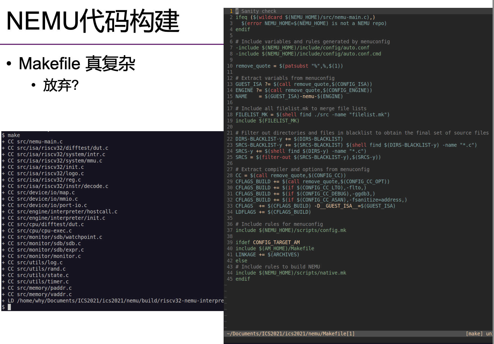

## NEMU框架选讲之编译运行_W4

**本讲概述**

* Git, GitHub 与代码仓库
  * Git 选讲
  * Git 在实验课中的应用
* 项目的构建
  * Lab
  * NEMU
  * AbstractMachine

### Git, GitHub 与代码仓库

**The UNIX-Hater's Handbook (and Beyond)**

写于 1994 年

* Simson Garfinkel 的主页有电子版
  * 说有道理也有道理
  * 说没道理也没道理
* 至少指出了 UNIX 的一些缺陷
  * user friendly
  * 命令行/系统工具的缺陷
* 但今天 UNIX/Linux 已经成熟多了！


无所不能的代码聚集地

* 有整个计算机系统世界的代码
  * 硬件、操作系统、分布式系统、库函数、应用程序……
学习各种技术的最佳平台

* 海量的文档、学习资料、博客 (新世界的大门)
  * 提供友好的搜索
    * 例子：awesome C

#### 学习 Git?

**RTFM?STFW!**
* 百度：得到一堆不太靠谱的教程
  * ~~请修改 hosts 永久屏蔽百度~~
* 大家已经见识过开源社区的力量了
  * [A Visual Git Reference](https://marklodato.github.io/visual-git-guide/index-en.html)
  * 好的文档是存在的
    * 还记得 tldr 吗？


Git怎么工作的----the missing semseter


#### 一些 Comments

有趣的 “--”

* UNIX 的设计缺陷 (UGH 中点名批评)
  * 虽然是编程语言，但 Shell 更贴近自然语言
  * 有很多 corner cases
    * 如果有一个文件叫 “-rf”……怎么删除它？？？
    * best practice: 文件名不以 “-” 开头、不含空格/符号……


体验 Git

* 创建一个新的 repo，自由探索
* [Visualizing Git Concepts with D3](http://onlywei.github.io/explain-git-with-d3)


**cont'd**

我们使用了 “白名单” .gitignore 文件

* 只在 Git repo 里管理 .c, .h 和 Makefile
  * 基本原则：一切生成的文件都不放在 Git 仓库中
```
*       # 忽略一切文件
!*/     # 除了目录
!*.c    # .c
!*.h    # ...
!Makefile*
!.gitignore
```
* 为什么 ls 看不到这个文件？
  * 怎么还有一个 .git


####  提交脚本

做了什么？？？

make submit 会下载执行 http://jyywiki.cn/static/submit.sh
```
bash -c "$(curl -s http://jyywiki.cn/static/submit.sh)"
```

```
# submit.sh (服务器)
COURSE=ICS2020
MODULE=$(git rev-parse --abbrev-ref HEAD | tr '[a-z]' '[A-Z]')
NAME=$(basename $(realpath .))
FILE=/tmp/upload.tar.bz2

cd .. && \
tar caf "$FILE" "$NAME/.git" $(find $NAME -maxdepth 1 -name "*.pdf") && \
curl -F "stuid=$STUID" -F "stuname=$STUNAME" \
  -F "course=$COURSE" -F "module=$MODULE" \
  -F "file=@$FILE" http://jyywiki.cn/upload

```

#### Git 追踪
 
另一段神秘代码 (来自 Makefile.lab)

```
git:
  @git add $(shell find . -name "*.c") \
    $(shell find . -name "*.h") -A --ignore-errors
  @while (test -e .git/index.lock); do sleep 0.1; done
  @(hostnamectl && uptime) | \
    git commit -F - -q --author=... --no-verify --allow-empty
  @sync # 《操作系统》课程为大家揭秘
```
在每次 make 执行时

* git 目标都会被执行
  * 将 .c 和 .h 添加、强制提交到 Git repo
  * Git 追踪抓抄袭


#### 小结：现代化的项目管理方式

Git: 代码快照管理工具

* 是一种 “可持久化数据结构”
* 拓展阅读：[Pro Git](https://git-scm.com/book/en/v2)
框架代码中的两处非常规 Git 使用

* 提交脚本
  * 仅上传 .git；在服务器执行 git reset
  * 减少提交大小 (仅源文件)
* Git 追踪
  * 编译时强制提交，获取同学编码的过程

  
思考题：如何管理自己的代码快照？

  * 提示：分支/HEAD/... 只是指向快照的指针 (references)


## 项目构建

**Make工具**

回顾：[YEMU-simuater](https://jyywiki.cn/pages/ICS/2020/demos/yemu.tar.gz)

* Makefile 是一段 “declarative” 的代码
  * 描述了构建目标之间的依赖关系和更新方法
    
    有向无环图；拓扑排序，如果没有关联可以并行编译``-j``
  * 同时也是和 Shell 结合紧密的编程语言
    * 能够生成各种字符串
    * 支持 “元编程” (#include, #define, ...)
    * C 与Unix离不开


顶层 (top-level) Makefile:
```
# := -> C #define
       NAME   := $(shell basename $(PWD))
export MODULE := Lab1

# 变量 -> 字面替换
all: $(NAME)-64 $(NAME)-32 //共需要 ？-64、？-32

# include -> C #include
include ../Makefile
```

**cont'd**

构建目标

* 总目标
  * .DEFAULT_GOAL := commit-and-make
  * commit-and-make: git all (all 在顶层 Makefile 中定义)
* 可执行文件
  * multimod-64: gcc -m64
  * multimod-32: gcc -m32
* 共享库 (之后的 lab 使用)
  * multimod-64.so: gcc -fPIC -shared -m64
  * multimod-32.so: gcc -fPIC -shared -m32
* clean
  * 删除构建的代码



#### NEMU 代码构建

Makefile 真复杂(how to read 1:25:00)

* ~~放弃~~
一个小诀窍

* 先观察 make 命令实际执行了什么 (trace)
* RTFM/STFW: make 提供的两个有用的选项
  * -n 只打印命令不运行
  * -B 强制 make 所有目标

```
make -nB \
 | grep -ve '^\(\#\|echo\|mkdir\)' \
 | vim -
```

类似C语言的预编译，看看make干了啥

嘿！其实没那么复杂

* 就是一堆 gcc -c (编译) 和一个 gcc (链接) 诶
  * 原来大部分 Makefile 都是编译选项

#### AbstractMachine 代码构建

更长，更难读

* 但我们给大家留了一个小彩蛋
* “现代” 的文档编写方式
  * “docs as code”
  * 例子：LLVM 使用 Doxygen 自动生成文档
```
### *Get a more readable version of this Makefile* by `make html` (requires python-markdown)
html:
    cat Makefile | sed 's/^\([^#]\)/    \1/g' | \
      markdown_py > Makefile.html
.PHONY: html
```

#### 关于《计算机系统基础》习题课
教会大家 “计算机的正确打开方式”

* 编程 ≠ 闷头写代码
* 使用工具也是编程的一部分
  * version-control systems: git, svn, ...
  * build systems: make, cmake (C++), maven (Java), ...
  * shell: bash, zsh, ...
基本原则：任何感到不爽的事情都一定有工具能帮你

* 如果真的没有，自己造一个的就会就来了
  * (不太可能是真的)
  * 但这将会是一份非常好的研究工作


## NEMU 框架选讲之代码导读_W5

* **NEMU 代码导读**
* 浏览源代码
* 启动代码选讲
* 编辑器配置

### RTFSC

拿到源代码，先做什么？

先大致了解一下

* 项目总体组织
  * tree 要翻好几个屏幕
  * find . -name "*.c" -o -name "*.h" (110+ 个文件)
* 项目规模
  * find ... | xargs cat | wc -l
  * 5,000+ 行 (其实很小了)

#### 尝试阅读代码：从 main 开始

C 语言代码，都是从 main() 开始运行的。那么哪里才有 main 呢？

* 浏览代码：发现 main.c，估计在里面
* 使用 IDE (vscode: Edit → Find in files)

The UNIX Way (无须启动任何程序，直接查看)
```
grep -n main $(find . -name "*.c") # RTFM: -n
find . | xargs grep --color -nse '\<main\>'
```
tools...STFW..fzf

```
grep
g:对每一行；
re：regular expression
p：print | 可以是其他任何命令:dd , rw ,,,
```

Vim 当然也支持

```
:vimgrep /\<main\>/ **/*.c
```
* 浏览 :cn, :cp, ...


自己看看源代码！！！


**parse_args()**

这个函数的名字起的很好，看了就知道要做什么

* 满足好代码不言自明的特性
  * 的确是用来解析命令行参数的，-b, -l, ...
  * 使用了 getopt → RTFM!
失败的尝试：man getopt → getopt (1)

成功的尝试

* 捷径版：STFW “C getopt” → 网页/博客/...
* 专业版：man -k getopt → man 3 getopt
意外之喜：man 还送了个例子！跟 parse_args 的用法一样耶


利用命令行进行抽象，保证一致性---小的测试框架，节省效率
```
test run-env
  gdb -s $(BINARY) --args $(NEMU_EXEC())
```

#### NEMU: 一个命令行工具

The friendly source code

* 命令行可以控制 NEMU 的行为
* 我们甚至看到了 --help 帮助信息

如何让我们的 NEMU 打印它？

* 问题等同于：make run 到底做了什么
  * 方法 1: 阅读 Makefile
  * 方法 2: 借助 GNU Make 的 -n 选项
> 开始痛苦的代码阅读之旅：坚持！

> 进行抽象的构建需要了解input和output，利用命令行进行最小的极限

### 代码选讲

#### static inline
``static inline void parse_args(int argc, char *argv[]) { ... }``

parse_args 函数是 static, inline 的，这是什么意思？

* inline (C99 6.7.4 #5): Making a function an inline function suggests that calls to the function be as fast as possible. The extent to which such suggestions are effective is implementation-defined. (inline更多有趣的行为请大家RTFM)
* static (C99 6.2.2 #3): If the declaration of a file scope identifier for an object or a function contains the storage- class specifier static, the identifier has internal linkage.

联合使用

* 告诉编译器符号不要泄露到文件 (translation unit) 之外。

##### 更多关于 static inline (1)

我们都知道，如果在两个文件里定义了重名的函数，能够分别编译，但链接会出错：
```
/* a.c */ int f() { return 0; }
/* b.c */ int f() { return 1; }
```
b.c:(.text+0x0): multiple definition of f; a.c:(.text+0xb): first defined here

这也是为什么不在头文件里定义函数的原因

* 两个 translation unit 同时引用，就导致 multiple definition，即使用static修饰，同样会出现问题：
* 思考题：为什么 C++ 能把 class 都定义到头文件里？？？像 vector 的实现就是直接粘贴进去的
* 一个函数能是static就是static


定义了没有使用：-Wall -Werror  //防止手滑把定义的局部函数打错，定义了却没有使用

##### 更多关于 static inline (2)

如果你的程序较短且性能攸关，则可以使用 static inline 函数定义在头文件中。例子 ``(**/x86/**/reg.h)``：

```
static inline int check_reg_index(int index) {
  assert(index >= 0 && index < 8);
  return index;
}

```
check_reg_index完全可以单独放在一个 C 文件里，头文件中只保留声明：
```
int check_reg_index(int index);
```
* 但这样会导致在编译时，编译出一条额外的 call 指令 (假设没有[LTO](http://gcc.gnu.org/wiki/LinkTimeOptimization))
* 使用 inline 可以在调用 check_reg_index(0) 编译优化成**零开销**

#### 新的问题：啥是 assert？
```
#define assert(cond) if (!(cond)) panic(...);
```

注意特殊情况：
```
if (...) assert(0); // 上面的assert对么？
else ...   //与最近的if配对...
```

```
#define assert(cond) \       //// nemu/**/debug.h
  do { \
    if (!(cond)) { \
      fprintf(stderr, "Fail @ %s:%d", __FILE__, __LINE__); \
      exit(1); \
    } \
  } while (0)

#define assert(cond) ({ ... })    //GCC
```


之后的历程似乎就比较轻松了。有些东西不太明白(比如 init_device())，但好像也不是很要紧，到了 welcome()：

```
static inline void welcome() {
  ...
  printf("Welcome to \33[1;41m\33[1;33m%s\33[0m-NEMU!\n",
    str(__ISA__)); // bad code! jyy doesn't like it.
}
```
哇，还能顺带打印出编译的时间日期，奇怪的知识又增加了！

* 初始化终于完成
* 啊……根本没碰到核心代码


### 理解代码：更进一步

现代化工具！！！

#### Vim: 这都搞不定还引发什么编辑器圣战

**Marks** (文件内标记)

* ma, 'a, mA, 'A, ...

**Tags** (在位置之间跳转)

* `` :jumps, C-], C-i, C-o, :tjump, ...``

**Tabs/Windows** (管理多文件)

* :tabnew, gt, gT, ...

**Folding** (浏览大代码)

* zc, zo, zR, ...

更多的功能/插件

* (RTFM, STFW)

#### VSCode: 现代工具来一套？

刚拿到手，VSCode 的体验并不是非常好

* 满屏的红线/蓝线
  * 因为 Code 并知道 NEMU 是怎么编译的
  * IDE “编译运行” 背后没有魔法
* 另一方面，这些东西一定是可以配置的
  * 配置解析选项: c_cpp_properties.json
    * 解锁正确的代码解析
  * 配置构建选项: tasks.json
    * 解锁 make (可跟命令行参数)
  * 配置运行选项: launch.json
    * 解锁单步调试 (我们并不非常推荐单步调试)


#### 插入福利：调试 Segmentation Fault

听说你的程序又 Segmentation Fault 了？
* ~~百度 Segmentation Fault 得到的首个回答的解释是完全错误的~~
* 正确的解释
  * 指令越权访问内存 (r/w/x)
    * 原因很多，数组越界、memory corruption, ...
  * 指令未被执行，进程收到 SIGSEGV 信号
    * 默认的信号处理程序会 core dump 退出
    * Gdb调试:backtrace


#### 好的编辑器：也许不是万能的

exec.c 也太难读了吧 ~~(元编程，害死人)~~
```
static inline def_EHelper(gp1) { // ???
  ...
  EMPTY(0) 
    // EMPTY(idx)  =>  EX(idx, inv)
    // EX(idx, inv)  =>  EXW(idx, inv, 0)
    // !@%#&%^!#@&%!^@%#$%*^!#@*
}

```
产生 “这是什么操作” 的困惑：

* 办法 1: RTFM + RTFSC + 写小程序尝试
* 办法 2: 预编译以后的代码应该好理解！
  * 还记得我们对 Makefile 的导读吗？
    * (说的容易做得难。直接 gcc -E 不是编译错误吗……)

##### Don't Give Up Easy

我们既然知道 Makefile 里哪一行是 .o → .c 的转换

* 我们添一个一模一样的 gcc -E 是不是就行了？
```
$(OBJ_DIR)/%.o: src/%.c
    @$(CC) $(CFLAGS) $(SO_CFLAGS) -c -o $@ $<
    @$(CC) $(CFLAGS) $(SO_CFLAGS) -E -MF /dev/null $< | \
      grep -ve '^#' | \
      clang-format - > $(basename $@).i
```

> 为了不断的抽象的构建，中间产物：反应整体

### 总结

#### 怎样读代码？

读代码 ≠ “读” 代码

* 用正确的工具，使自己感到舒适
* 但这个过程本身可能是不太舒适的 (走出你的舒适区)
  * 我们看到太多的同学，到最后都没有学会使用编辑器/IDE
  * **要相信一切不爽都有办法解决**

信息来源

* 在 /etc/hosts 中屏蔽百度
* 去开源社区找 tutorials
  * 例子：[vim-galore](https://github.com/mhinz/vim-galore), [awesome-c](https://github.com/kozross/awesome-c)


# Vim try

