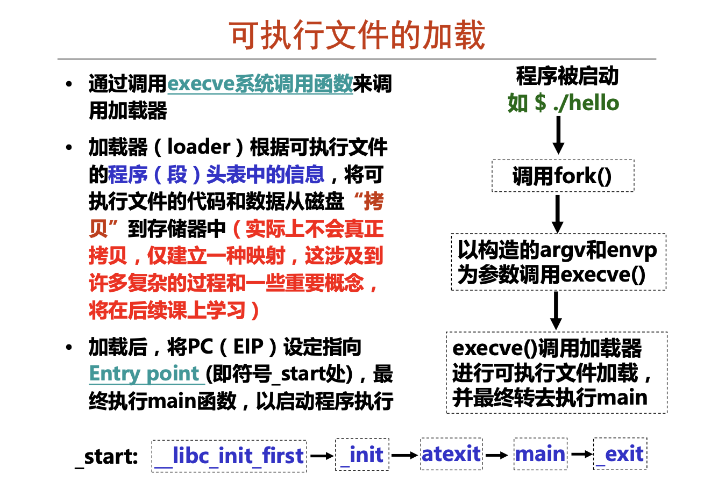
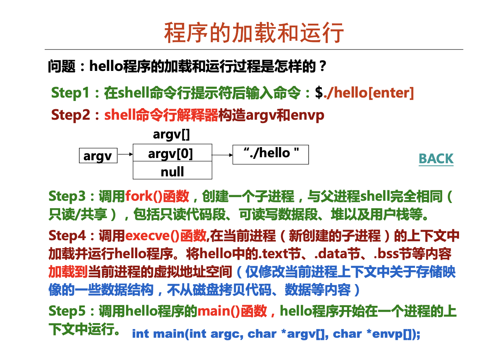
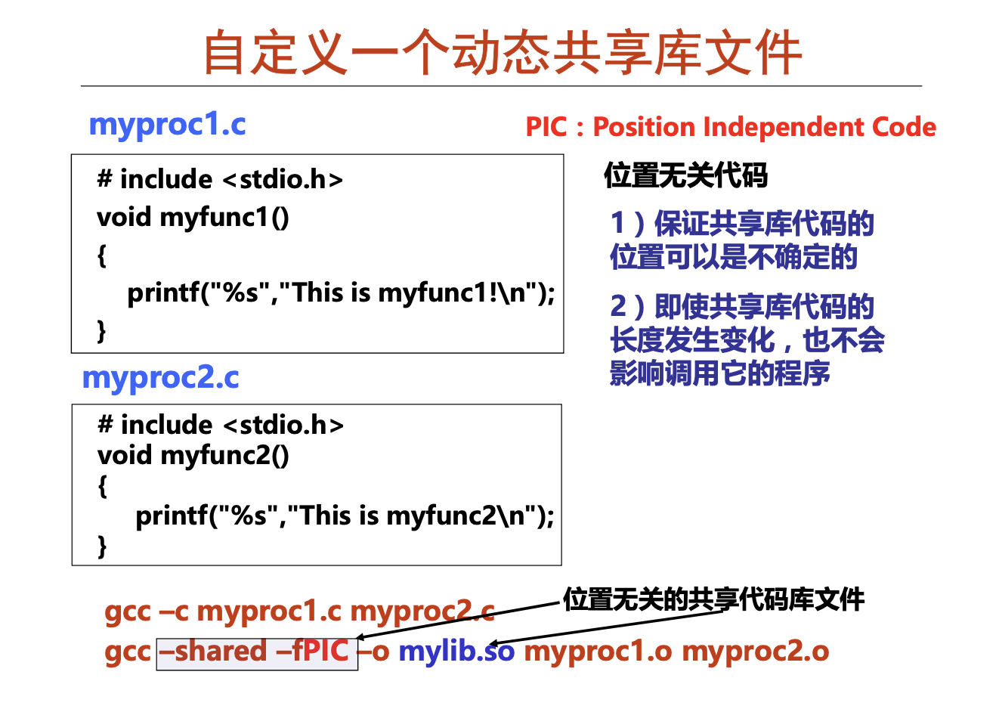
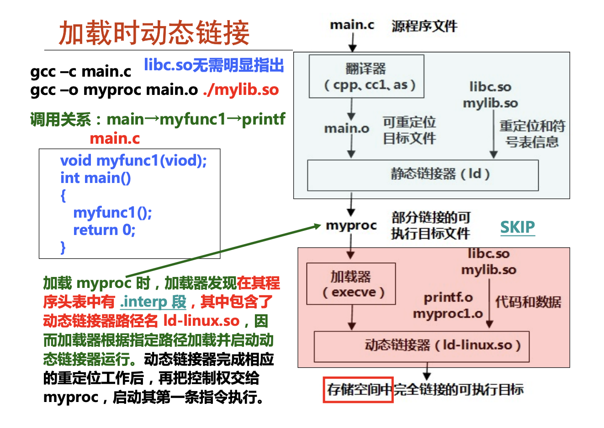
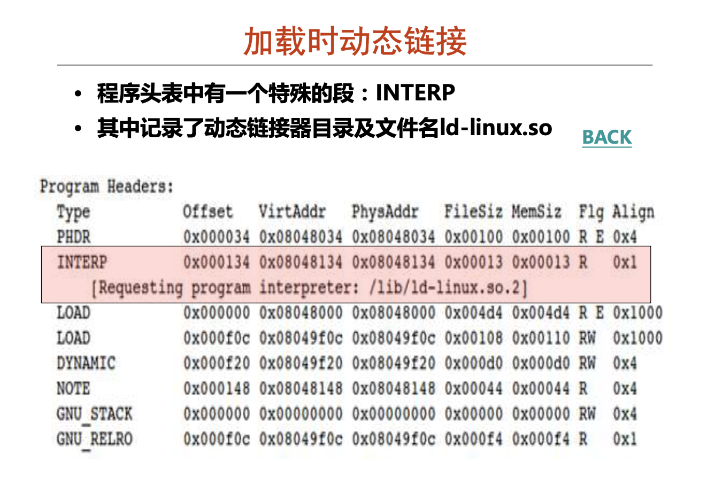
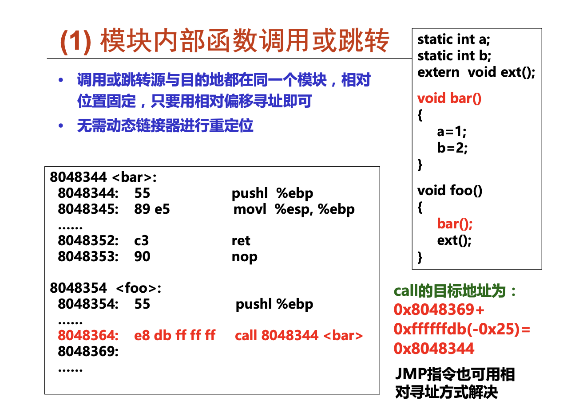
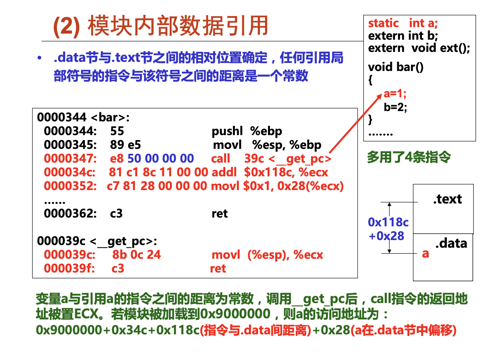
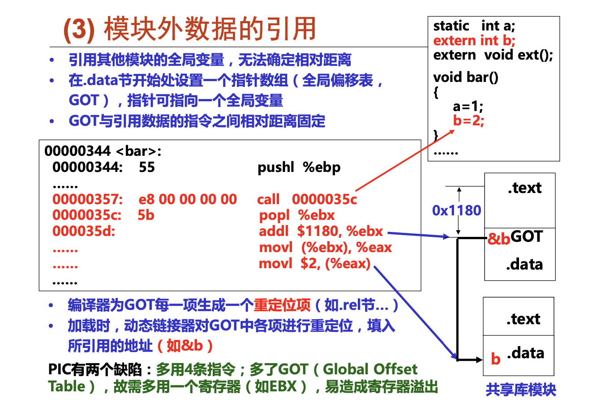
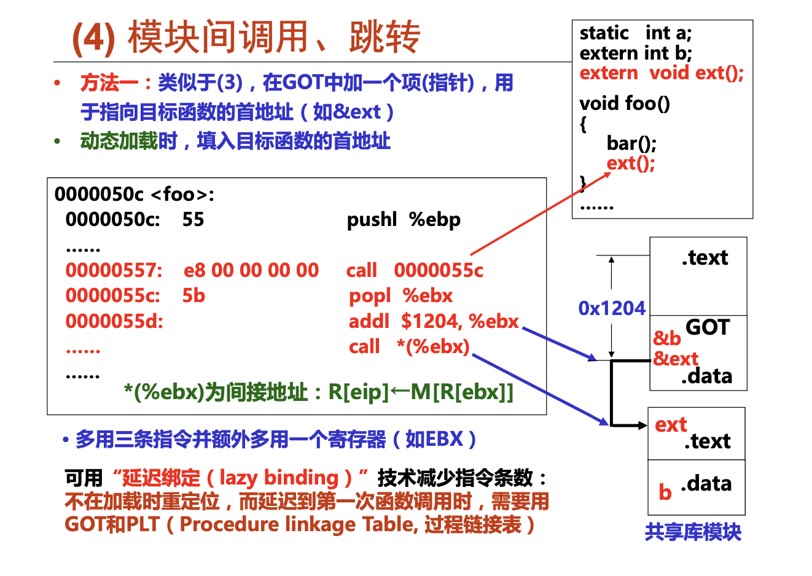
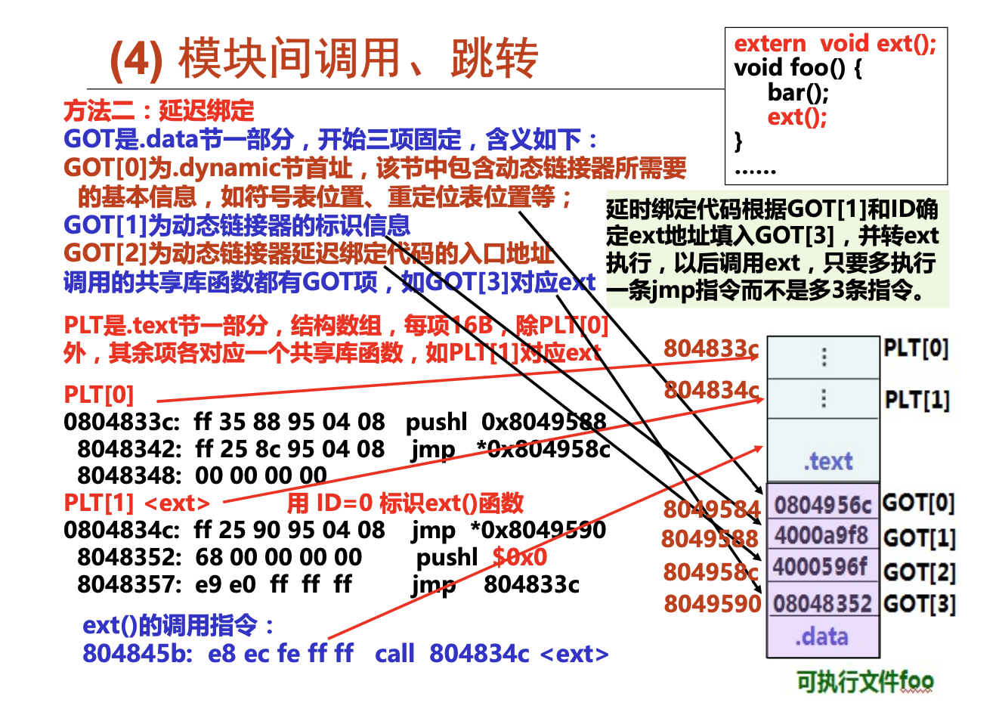

# 程序的链接
W10-1-1(可执行文件生成过程概述)
链接过程目标文件;可重定位目标文件；可执行目标文件；共享库文件；

**预处理**
* 预处理命令
  * ``$gcc –E hello.c –o hello.i`` 
  * ``$cpp hello.c > hello.i``
* 处理源文件中以“#”开头的预编译指令，包括:
  * 删除“#define”并展开所定义的宏
  * 处理所有条件预编译指令，如“#if”,“#ifdef”, “#endif”等 – 插入头文件到“#include”处，可以递归方式进行处理
  * 删除所有的注释“//”和“/* */”
  * 添加行号和文件名标识，以便编译时编译器产生调试用的行号信息
  * 保留所有#pragma编译指令(编译器需要用)
* 经过预编译处理后，得到的是预处理文件(如，hello.i) ，它还 是一个可读的文本文件 ，但不包含任何宏定义
**头文件(.h文件)的作用**PPT

**编译**
* 编译过程就是将预处理后得到的预处理文件(如 hello.i)进行 词法分析、语法分析、语义分析、优化后，生成汇编代码文件
* 用来进行编译处理的程序称为编译程序(编译器，Compiler)
* 编译命令
  * ``$gcc –S hello.i –o hello.s``
  * ``$gcc –S hello.c –o hello.s``
  * ``$/user/lib/gcc/i486-linux-gnu/4.1/cc1 hello.c``
* 经过编译后，得到的汇编代码文件(如 hello.s)还是可读的文 本文件，CPU无法理解和执行它
**gcc命令实际上是具体程序(如ccp、cc1、as等)的包装命令， 用户通过gcc命令来使用具体的预处理程序ccp、编译程序cc1和汇编程序as等**

**汇编**

* 汇编代码文件(由汇编指令构成)称为汇编语言源程序
* 汇编程序(汇编器)用来将汇编语言源程序转换为机器指令序列(机器语言程序)
* 汇编指令和机器指令一一对应，前者是后者的符号表示，它们都属于机器级指令，所构成的程序称为机器级代码
* 汇编命令
  * ``$gcc –c hello.s –o hello.o``
  * ``$gcc –c hello.c –o hello.o``
  * ``$as hello.s -o hello.o (as是一个汇编程序)``
* 汇编结果是一个可重定位目标文件(如，hello.o)，其中包含 的是不可读的二进制代码，必须用相应的工具软件来查看其内容

**链接**
* 预处理、编译和汇编三个阶段针对一个模块(一个*.c文件)进行处理，得到对应的一个可重定位目标文件(一个*.o文件)
* 链接过程将多个可重定位目标文件合并以生成可执行目标文件
* 链接命令
  * ``$gcc –static –o myproc main.o test.o``
  * ``$ld –static –o myproc main.o test.o``
  * –static 表示静态链接，如果不指定-o选项，则可执行文件名 为“a.out”

从本周开始主要介绍如何进行程序模块的链接

W10-1-2(链接器的由来)
**链接器的由来**
* 原始的链接概念早在高级编程语言出现之前就已存在
* 最早程序员用机器语言编写程序，并记录在纸带或卡片上(修改一条命令，就得重新打孔)
* 用符号表示跳转位置和变量位置，是否简化了问题?
* 汇编语言出现
  * 用助记符表示操作码
  * 用符号表示位置
  * 用助记符表示寄存器
* 更高级编程语言出现
  * 程序越来越复杂，需多人开发不同的程序模块
  * 子程序(函数)起始地址和变量起始地址是符号定义(definition)
  * 调用子程序(函数或过程)和使用变量即是符号的引用(reference) 
  * 一个模块定义的符号可以被另一个模块引用
  * 最终须链接(即合并)，合并时须在符号引用处填入定义处的地址 
  如上例，先确定L0的地址，再在jmp指令中填入L0的地址

**链接操作的步骤**
1. 确定符号引用关系(符号解析)
2. 合并相关.o文件(重定位)
3. 确定每个符号的地址
4. 在指令中填入新地址
* Step1 符号解析(Symbol resolution)
  * 程序中有定义和引用的符号 (包括变量和函数等)
    * ``void swap() {...} /* 定义符号swap */
 swap(); /* 引用符号swap */
int*xp=&x; /*定义符号xp,引用符号x*/``
    * 编译器将定义的符号存放在一个符号表（ symbol table）中.
       * 符号表是一个结构数组
       *  每个表项包含符号名、长度和位置等信息
    * 链接器将每个符号的引用都与一个确定的符号定义建立关联
* Step 2. 重定位
  * 将多个代码段与数据段分别合并为一个单独的代码段和数据段  
  * 计算每个定义的符号在虚拟地址空间中的绝对地址
  * 将可执行文件中符号引用处的地址修改为重定位后的地址信息
**使用链接的好处**
* 链接带来的好处1:模块化
  * 一个程序可以分成很多源程序文件 
  * 可构建公共函数库，如数学库，标准C库等(代码重用，开发效率高)
* 链接带来的好处2:效率高
  * 时间上，分开编译
    * 需重新编译被修改的源程序文件，然后重新链接
  * 空间上，无需包含共享库所有代码
    * 源文件中无需包含共享库函数的源码，只要直接调用即可(如，只要直接调用printf()函数，无需包含其源码)
    * 可执行文件和运行时的内存中只需包含所调用函数的代码而不需要包含整个共享库

W10-2-1(链接过程的本质)
链接的本质；三类目标文件；目标文件中目标带码举例；目标文件的格式标准；ELF标准格式的两种视图；

**一个C语言程序举例**
每个模块有自己的代码、数据(初始化全局变量、未初始化全局变
量，静态变量、局部变量)
局部变量temp分配在栈中，不会在过程外被引用，因此不是符号定义
void swap()

**链接过程的本质**：合并相同的"节"
**可执行文件的存储器映射**
看视频

W10-2-2(目标文件的两种视图)
**三类目标文件**
* 可重定位目标文件 (.o)
  * 其代码和数据可和其他可重定位文件合并为可执行文件
    * 每个.o 文件由对应的.c文件生成
    * 每个.o文件代码和数据地址都从0开始
* 可执行目标文件 (默认为a.out)(Windows中的*.exe)
  * 包含的代码和数据可以被直接复制到内存并被执行
  * 代码和数据地址为虚拟地址空间中的地址
* 共享的目标文件 (.so)
  * 特殊的可重定位目标文件，能在装入或运行时被装入到内存并自动被链接，称为共享库文件
  * Windows 中称其为 Dynamic Link Libraries (DLLs)
    不能单独运行，一定是被链接到目标文件中。

**目标文件的格式**
* **目标代码(Object Code)**指编译器和汇编器处理源代码后所生成的机器语言目标代码
* **目标文件(Object File)**指包含目标代码的文件
* 最早的目标文件格式是自有格式，非标准的
* 标准的几种目标文件格式
  * DOS操作系统(最简单) :COM格式，文件中仅包含代码和数据，且被加载到固定位置
  * System V UNIX早期版本:COFF格式，文件中不仅包含代码和数据 ，还包含重定位信息、调试信息、符号表等其他信息，由一组严格定 义的数据结构序列组成
  * Windows: PE格式(COFF的变种)，称为可移植可执行( Portable Executable，简称PE)
  * Linux等类UNIX:ELF格式(COFF的变种)，称为可执行可链接( Executable and Linkable Format，简称ELF)
  

**Executable and Linkable Format (ELF)** textbook_P186
* 两种视图
  * 链接视图(被链接):可重定位目标文件 (Relocatable object files) 
  节(section)是 ELF 文件中具有相 同特征的最小可处理单位.text节: 代码 .data节: 数据 .rodata: 只读数据 .bss: 未初始化数据
  * 执行视图(被执行):可执行目标文件(Executable object files)
  由不同的段( segment)组成，描述节如何映射到存储段中，可多个节映射到同一段，如:可合 并.data节和 .bss节,并映射到一个可读可写数据段中
**链接视图——可重定位目标文件**
* 可被链接(合并)生成可执行文件或共享目标文件
* 静态链接库文件由若干个可重定位目标文件组成
* 包含代码、数据(已初始化.data和未初始化.bss)
* 包含重定位信息(指出哪些符号引用处需要重定位)
* 文件扩展名为.o(相当于Windows中的 .obj文件)

W10-3-1(可重定位文件概述)
ELF可重定位目标文件的格式；ELF头的数据结构；ELF头信息举例；节头表的数据结构；节头表信息举例
**可重定位目标文件格式**
* ELF 头
  * 包括16字节标识信息、文件类型 (.o, exec, .so)、机器类型(如 IA-32)、 节头表的偏移、节头表的表项大小以及 表项个数
* .text 节
  * 编译后的代码部分
* .rodata节
  * 只读数据，如printf格式串，switch跳转表等
* .data 节
  * 以初始化的全局变量
* .bss节
  * 未初始化全局变量，仅是占位符，不占 据任何实际磁盘空间。区分初始化和非 初始化是为了空间效率
* .symtab节
  * 存放函数和全局变量(符号表)信息，它不包括局部变量
* .rel.text节
  * .text节的重定位信息，用于重新修改代 码段的指令中的地址信息
* rel.data节
  * .data节的重定位信息，用于对被模块使 用或定义的全局变量进行重定位的信息
* .debug节
  * 调试用符号表 (gcc -g) 
* strtab节
  * 包含symtab和debug节中符号及节名
* Section header table(节头表)
  * 每个节的节名、偏移和大小

**未初始化变量(.bss节)**
* C语言规定:
  * 未初始化的全局变量和局部静态变量的默认初始值为0
* 将未初始化变量(.bss节)与已初始化变量(.data节)分开的 好处
  * .data节中存放具体的初始值，需要占磁盘空间
  * .bss节中无需存放初始值，只要说明.bss中的每个变量将来 在执行时占用几个字节即可，因此，.bss节实际上不占用磁 盘空间，提高了磁盘空间利用率
* BSS(Block Started by Symbol)最初是UA-SAP汇编程序 中所用的一个伪指令，用于为符号预留一块内存空间
* 所有未初始化的全局变量和局部静态变量都被汇总到.bss节中， 通过专门的“节头表(Section header table)”来说明应该 为.bss节预留多大的空间

W10-3-2(ELF头和节头表)
**可重定位目标文件格式**(textbook_P187)

魔数：文件开头几个字节通常用来确定文件的类型或格式
a.out的魔数：01H 07H
PE格式魔数：4DH 5AH
加载或读取文件时，可用魔数确认文件类型是否正确

**节头表(Sectioin Header Table）**textbook)_P189

* 除ELF头之外，节头表是ELF可重定位目标文件中最重要的部分内容
* 描述每个节的节名、在文件中的偏移、大小、访问属性、对齐方式等
*  以下是32位系统对应的数据结构（每个表项占40B）

有4个节将会分配存储空间
.text：可执行
.data和.bss：可读可写
.rodata：可读

看讲解——整个串了起来


W10-4-1(可执行文件概述)

ELF可执行目标文件格式；ELF头信息举例；可执行文件的存储器映像；程序头表的数据结构；程序头表信息举例；

* 与可重定位文件稍有不同：
  * ELF头中字段e_entry给出执行程序时第一条指令的地址，而在可重定位文件中，此字段为0
  * 多一个程序头表，也称段头表（segment header table），是一个结构数组
  *  多一个.init节，用于定义_init函数，该函数用来进行可执行目标文件开始执行时的初始化工作
  * 少两个.rel节（无需重定位）

**ELF头信息举例**

**可执行文件的存储器映像**

**执行视图-可执行目标文件**

* 包含代码、数据(已初始化.data和未初始化.bss)
* 定义都所有变量和函数已有确定地址(虚拟地址空间中的地址)
* 符号引用处已被重定位，以指向所引用的定义符号
* 没有文件扩展名或默认为a.out(相当于Windows中的.exe文件)
* 可被CPU直接执行，指令地址和指令给出的操作数地址都是虚拟地址

为了能执行，还需将具相同访问属性的节合并成段(Segment),并说明每个段的属性，如：在可执行文件中的位移、大小、在虚拟空间中的位置、对齐方式、访问属性等

**可执行文件中的程序头表**

* 程序头表描述可执行文件中的节与虚拟空间中的存储段之间的映射关系

* 一个表项（32B）说明虚拟地址空间中一个连续的段或一个特殊的节

* 以下是某可执行目标文件程序头表信息有8个表项，其中两个为可装入段（即Type=LOAD）

  

  

  W11-1-1(符号和符号表的基本概念)

  怎么从可重定位文件到可执行文件？链接=符号解析+重定位

  符号及符号表；静态链接与符号解析；符号的重定位；可执行文件的加载以及共享库和动态链接；

  

链接操作的步骤

见上一讲概述；


**链接符号的类型**

每个可重定位目标模块m都有一个符号表，它包含了在m中定义和引用的符号。有三种链接器符号：

* Global symbols（模块内部定义的全局符号）
  * 由模块m定义并能被其他模块引用的符号。例如，非static C函数和非static的C全局变量（指不带static的全局变量）
    如，main.c 中的全局变量名buf

* External symbols（外部定义的全局符号）
  * 由其他模块定义并被模块m引用的全局符号

  如，main.c 中的函数名swap

* Local symbols（本模块的局部符号）

  * 仅由模块m定义和引用的本地符号。例如，在模块m中定义的带static的C函数和全局变量

  如，swap.c 中的static变量名bufp1

链接器局部符号不是指程序中的局部变量（分配在栈中的临
时性变量）,链接器不关心这种局部变量

**目标文件中的符号表**textbook_P195


W11-1-2(全局符号的强弱特性)

**符号解析（Symbol Resolution）**

* 目的：将每个模块中引用的符号与某个目标模块中的定义符号建立关联。
* 每个定义符号在代码段或数据段中都被分配了存储空间，将引用符号与定义符号建立关联后，就可在重定位时将引用符号的地址重定位为相关联的定义符号的地址。
* 本地符号在本模块内定义并引用，因此，其解析较简单，只要与本模块内唯一的定义符号关联即可。
*  全局符号（外部定义的、内部定义的）的解析涉及多个模块，故较复杂。

符号解析也称符号绑定

“符号的定义”其实质是什么？	指被分配了存储空间。为函数名即指其代码
所在区；为变量名即指其所占的静态数据区。
所有定义符号的值就是其目标所在的首地址

**全局符号的强弱**

* 函数名和已初始化的全局变量名是强符号
* 未初始化的全局变量名是弱符号

**链接器对符号的解析规则**

* 多重定义符号的处理规则
  * Rule 1: 强符号不能多次定义
    * 强符号只能被定义一次，否则链接错误
  * Rule 2: 若一个符号被定义为一次强符号和多次弱符号，则按强定义为准
    * 对弱符号的引用被解析为其强定义符号
  * Rule 3: 若有多个弱符号定义，则任选其中一个
    * 使用命令gcc –fno-common链接时，会告诉链接器在遇到多个弱定义的全局符号时输出一条警告信息。

符号解析时只能有一个确定的定义（即每个符号仅占一处存储空间）


W11-1-3(多重符号定义举例)

textbook_P197

**多重定义全局符号的问题**

* 尽量避免使用全局变量
* 一定需要用的话，就按以下规则使用
  * 尽量使用本地变量（static），模块内引用不太会出错
  * 全局变量要赋初值，使成为强符号，易查出链接错误
  * 外部全局变量要使用extern，以示其引用的定义在其他模块

多重定义全局变量会造成一些意想不到的错误，而且是默默发生
的，编译系统不会警告，并会在程序执行很久后才能表现出来，
且远离错误引发处。特别是在一个具有几百个模块的大型软件中，
这类错误很难修正。
大部分程序员并不了解链接器如何工作，因而养成良好的编程习
惯是非常重要的。


W11-2-1(静态共享库的创建)

常用标准静态库；自定义静态库的创建；符号解析过程；链接顺序问题；

**如何划分模块?**

**静态链接对象**

多个可重定位目标模块(.o文件)+ 静态库（标准库、自定义库）(.a文件，其中包含多个.o模块)

* 库函数模块：许多函数无需自己写，可使用共享的库函数
  * 如数学库, 输入/输出库, 存储管理库，字符串处理等
* 对于自定义模块，避免以下两种极端做法
  * 将所有函数都放在一个源文件中
    * 修改一个函数需要对所有函数重新编译
    * 时间和空间两方面的效率都不高
  * 一个源文件中仅包含一个函数
    * 需要程序员显式地进行链接
    * 效率高，但模块太多，故太繁琐

**静态共享库**

* 将所有相关的目标模块（.o）打包为一个单独的库文件（.a），称为静态库文件，也称存档文件（archive）
* 使用静态库，可增强链接器功能，使其能通过查找一个或多个库文件中定义的符号来解析符号
* 在构建可执行文件时，只需指定库文件名，链接器会自动到库中寻找那些应用程序用到的目标模块，并且只把用到的模块从库中拷贝出来
* 在gcc命令行中无需明显指定C标准库libc.a(默认库)
* Archiver（归档器）允许增量更新，只要重新编译需修改的源码并将其.o文件替换到静态库中。

ar(归档程序)：能将指定的.o文件打包生成静态库文件(.a文件)

**常用静态库**

* lib.a(C标准库)
  * 1392个目标文件（大约8 MB）
  * 包含I/O、存储分配、信号处理、字符串处理、时间和日期、随机
    数生成、定点整数算术运算
* libm.a(the C math library)
  * 401 个目标文件（大约1 MB）
  * 浮点数算术运算(如sin, cos, tan, log, exp, sqrt, …)

```
% ar -t /usr/lib/libc.a | sort
…f
ork.o
…
fprintf.o
fpu_control.o
fputc.o
freopen.o
fscanf.o
fseek.o
fstab.o
…
```

利用以上命令，将.o文件打包

```
$ gcc –c main.c
$ gcc –static –o myproc main.o ./mylib.a
```


在gcc命令行中无需明显指定C标准库lib.a(默认库)


W11-2-2(符号解析过程)

***链接器中符号解析的全过程*** 

E 将被合并以组成可执行文件的所有目标文件集合
U 当前所有未解析的引用符号的集合
D 当前所有定义符号的集合

开始E、U、D为空，首先扫描main.o，把它加入E，同时把myfun1加入U，main加入D。接着扫描到mylib.a，将U中所有符号（本例中为myfunc1）与mylib.a中所有目标模块（myproc1.o和myproc2.o）依次匹配，发现在myproc1.o中定义了myfunc1，故myproc1.o加入E，myfunc1从U转移到D。在myproc1.o中发现还有未解析符号printf，将其加到U。不断在mylib.a的各模块上进行迭代以匹配U中的符号，直到U、D都不再变化。此时U中只有一个未解析符号printf，而D中有main和myfunc1。因为模块myproc2.o没有被加入E中，因而它被丢弃。

接着，扫描默认的库文件libc.a，发现其目标模块printf.o定义了printf，于是printf也从U移到D，并将printf.o加入E，同时把它定义的所有符号加入D而所有未解析符号加入U。处理完libc.a时，U一定是空的


W11-2-3(链接顺序问题)textbook_P201

**使用静态库**

* 链接器对外部引用的解析算法要点如下:
  * 按照命令行给出的顺序扫描.o 和.a 文件
  * 扫描期间将当前未解析的引用记录到一个列表U中
  * 每遇到一个新的.o 或.a 中的模块，都试图用其来解析U中的符号
  * 如果扫描到最后，U中还有未被解析的符号，则发生错误
* 问题和对策
  * 能否正确解析与命令行给出的顺序有关
  * 好的做法：将静态库放在命令行的最后

**链接的步骤**

符号解析
（同节合并
确定地址
修改引用)重定位

看课；slide


W12-1-1(重定位的基本概念)

重定位的大致过程；重定位信息；PC相对地址重定位方式举例；绝对地址重定位方式举例；

**重定位**

符号解析完成后，可进行重定位工作，分三步

* 合并相同的节

  * 将集合E的所有目标模块中相同的节合并成新节

    例如，所有.text节合并作为可执行文件中的.text节

* 对定义符号进行重定位（确定地址）

  * 确定新节中所有定义符号在虚拟地址空间中的地址

    例如，为函数确定首地址，进而确定每条指令的地址，为变量确
    定首地址

  * 完成这一步后，每条指令和每个全局或局部变量都可确定地址

* 对引用符号进行重定位（确定地址）

  * 修改.text节和.data节中对每个符号的引用（地址）

    需要用到在.rel_data和.rel_text节中保存的重定位信息

**重定位信息**

* 汇编器遇到引用时，生成一个重定位条目
* 数据引用的重定位条目在.rel_data节中
* 指令中引用的重定位条目在.rel_text节中
* ELF中重定位条目格式如下：

```
typedef struct {
int offset; /*节内偏移*/
int symbol:24, /*所绑定符号*/
type: 8; /*重定位类型*/
} Elf32_Rel;
```

* IA-32有两种最基本的重定位类型
  * R_386_32: 绝对地址
  * R_386_PC32: PC相对地址

例如，在rel_text节中有重定位条目

```
offset: 0x1
symbol: B
type: R_386_32
```

重定位条目和汇编后的机器代码在哪种目标文件中？
在可重定位目标（.o）文件中！


W12-1-2(PC相对地址重定位)

用命令readelf -r main.o可显示main.o中的重定位条目（表项）

**R_386_PC32的重定位方式**

* 假定：

  * 可执行文件中main函数对应机器代码从0x8048380开始
  *  swap紧跟main后，其机器代码首地址按4字节边界对齐

* 则swap起始地址为多少？

  * 0x8048380+0x12=0x8048392
  * 在4字节边界对齐的情况下，是0x8048394

* 则重定位后call指令的机器代码是什么？

  * 转移目标地址=PC+偏移地址，PC=0x8048380+0x07-init
  * PC=0x8048380+0x07-(-4)=0x804838b
  * 重定位值=转移目标地址-PC=0048394-0x804838b=0x9
  * call指令的机器代码为“e8 09 00 00 00”

  PC在执行call指令的下一条命令的地址

  PC相对地址方式下，重定位值计算公式为：
  ADDR(r_sym) – ( ( ADDR(.text) + r_offset ) – init )
  引用目标处           call指令下条指令地址 即当前PC的值


W12-1-3(绝对地址重定位)P_204
**R_386_32的重定位方式**


* 假定：
  * buf在运行时的存储地址ADDR(buf)=0x8049620
* 则重定位后，bufp0的地址及内容变为什么？
  * buf和bufp0同属于.data节，故在可执行文件中它们被合并
  * bufp0紧接在buf后，故地址为0x8049620+8= 0x8049628
  * 因是R_386_32方式，故bufp0内容为buf的绝对地址 0x8049620，即“20 96 04 0
  
  可执行目标文件中.data节的内容
  ```
  Disassembly of section .data: 
      08049620 <buf>:
      8049620: 01 00 00 00 02 00 00 00
      08049628 <bufp0>:
      8049628: 20 96 04 08
  ```

W12-1-4(符号重定位举例)
.text节中的重定位过程
书P_205


W12-2(可执行文件的加载)
可执行文件的存储器映像；execve()函数的功能；可执行文件的加载过程；
书中没有

真正的信息是存在于物理的磁盘中，借由技术的想象力；
栈堆在内存中
**可执行文件的加载**

**程序的加载和运行**
* UNIX/Linux系统中，可通过调用execve()函数来启动加载器。
* execve()函数的功能是在当前进程上下文中加载并运行一个新程序。
  execve()函数的用法如下:
``int execve(char *filename, char *argv[], *envp[]);``
  filename是加载并运行的可执行文件名(如./hello)，可带参数列表 argv和环境变量列表envp。若错误(如找不到指定文件filename) ，则返回-1，并将控制权交给调用程序; 若函数执行成功，则不返回 ，最终将控制权传递到可执行目标中的主函数main。
* 主函数main()的原型形式如下:
``int main(int argc, char **argv, char **envp); ``或者:
``int main(int argc, char *argv[], char *envp[]);``
   argc指定参数个数，参数列表中第一个总是命令名(可执行文件名) 
   例如:命令行为“ld -o test main.o test.o” 时，argc=6



创建子程序，与父进程shell完全相同
Entry point不在ELF头内
！[chep4-2-4](../picture/chep4-2-4.png)

W12-3-1(共享库和动态链接概述)
动态链接的共享库；自定义共享库的创建；加载时的动态链接过程；运行时的动态链接方式；位置无关代码(PIC)(模块内调用或跳转、模块内数据访问；模块间调用或跳转、模块间数据访问)

**动态链接的共享库(Shared Libraries)**
* 静态库有一些缺点:
  * 库函数(如printf)被包含在每个运行进程的代码段中，对于并发 运行上百个进程的系统，造成极大的主存资源浪费
  * 库函数(如printf)被合并在可执行目标中，磁盘上存放着数千个 可执行文件，造成磁盘空间的极大浪费
  * 程序员需关注是否有函数库的新版本出现，并须定期下载、重新编 译和链接，更新困难、使用不便
* 解决方案: Shared Libraries (共享库)
  * 是一个目标文件，包含有代码和数据
  * 从程序中分离出来，磁盘和内存中都只有一个备份
  * 可以动态地在装入时或运行时被加载并链接
  * Window称其为动态链接库(Dynamic Link Libraries，.dll文件)
  * Linux称其为动态共享对象( Dynamic Shared Objects, .so文件)

**共享库(Shared Libraries)**
动态链接可以按以下两种方式进行：
*  在第一次加载并运行时进行 (load-time linking). 
   *  Linux通常由动态链接器(ld-linux.so)自动处理 
   *  标准C库 (libc.so) 通常按这种方式动态被链接
* 在已经开始运行后进行(run-time linking).
  * 在Linux中，通过调用 dlopen()等接口来实现
    * 分发软件包、构建高性能Web服务器等 
  在内存中只有一个备份，被所有进程共享，节省内存空间 
  一个共享库目标文件被所有程序共享链接，节省磁盘空间 
  共享库升级时，被自动加载到内存和程序动态链接，使用方便 
  共享库可分模块、独立、用不同编程语言进行开发，效率高 
  第三方开发的共享库可作为程序插件，使程序功能易于扩展







**运行时动态链接**
可通过动态链接器接口提供的函数在运行时进行动态链接
类UNIX系统中的动态链接器接口定义了相应的函数，如 dlopen, dlsym, dlerror、dlclose等， 其头文件为dlfcn.h
textbookP_209

W12-3-2(模块内引用和模块间数据引用)
**位置无关代码（PIC）**
* 动态链接用到一个重要概念:
  * 位置无关代码(Position-Independent Code，PIC
  * GCC选项-fPIC指示生成PIC代码 
  要实现动态链接，必须生成PIC代码
* 共享库代码是一种PIC
  * 共享库代码的位置可以是不确定的
  * 即使共享库代码的长度发生变化，也不影响调用它的程序 
* 引入PIC的目的
  * 链接器无需修改代码即可将共享库加载到任意地址运行 
* 所有引用情况
1. 模块内的过程调用、跳转，采用PC相对偏移寻址 
2. 模块内数据访问，如模块内的全局变量和静态变量
   要生成PIC代码，主要解决这两个问题
3. 模块外的过程调用、跳转
4. 模块外的数据访问，如外部变量的访问


使用相对位移，只要标志出目标地址与下条指令的相对位移即可；

* .data节与.text节之间的相对位置确定，任何引用局部符号的指令与该符号之间的距离是一个常数
比静态链接多4条指令



W12-3-3(模块间的调用或跳转)


不懂了再看一遍视频