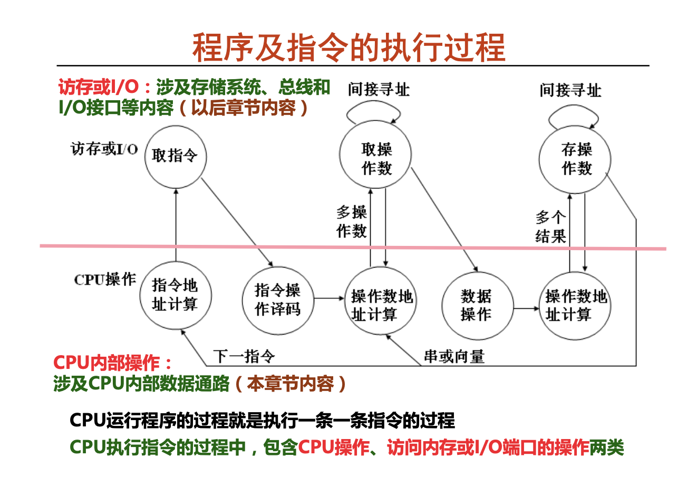

# 程序的执行和存储访问

1.1.1(引言)
程序和指令的关系；一条指令的执行过程；在IA-32中一条指令的执行过程；CPU的基本功能与结构(包括数据通路和控制器的基本功能和基本结构)；

1.2.1(程序和指令的关系)
**程序及指令的执行过程**
* 程序和指令的关系
  * 程序由一条一条指令组成，指令按顺序存放在内存连续单元
* 程序的执行:周而复始地执行一条一条指令
  * 正常情况下，指令按其存放顺序执行
  * 遇到需改变程序执行流程时，用相应的转移指令(包括无条件转移指令、条件转移指令、调用指令和返回指令等) 来改变程序执行流程
* 程序的执行流的控制
  * 将要执行的指令所在存储单元的地址由程序计数器PC给出，通过改变PC的值来控制执行顺序(PC$\rightarrow$EIP)
* 指令周期:CPU取出并执行一条指令的时间

CPI(Cycles Per Instruction)每个指令花费的时间---一台机器的CPI将指令完成平均的CPI

译码之后才能知道取值的长度

1.3.1(一条指令的执行过程)

CPU 指令 流水线：CPU提前源源不断的取值，然后改变PC的值

诸多异常：程序性中断，外部IO中断

**机械指令的执行过程**
* 取指令:从PC所指单元取出指令送指令寄存器(IR)，并增量PC。
  * 如add函数，开始PC(IA-32的EIP)中存放的是0x0848394，CPU根 据PC取指令送IR，每次总是取最长指令字节数，假定最长指令是4个字 节，即IR为32位，此时，也即55 89 E5 8BH被取到IR中。(若为变长架构下，取最长)
* 指令译码:不同指令其功能不同，因而需要不同的操作控制信号。
  * CPU根据不同操作码译出不同控制信号。对于上述取到IR中的55 89 E5 8BH译码时，可根据高5位01010译码得到push指令的控制信号。
* 源操作数地址计算并取操作数:根据寻址方式确定源操作数地址计算方式， 若是存储器数据，则需一次或多次访存;若为间接寻址或两操作数都在存储 器的双目运算，则需多次访存;若是寄存器数据，则直接从寄存器取数。
* 执行数据操作:在ALU或加法器等运算部件中对取出的源操作数进行运算。
* 目的操作数地址计算并存结果:根据寻址方式确定目的操作数地址计算方式 ，若是存储器数据，则需要一次或多次访存(间接寻址时);若是寄存器数 据，则在进行数据操作时直接存结果到寄存器。
* 指令地址计算并将其送PC。顺序执行时，PC加上当前指令长度;遇到转移类 指令时，则需要根据条件码、操作码和寻址方式等确定下条指令地址。

1.4.1(IA-32的指令的大致执行过程)
* 每条指令的功能总是由以下四种基本操作来实现: 
  读取某一主存单元的内容，并将其装入某个寄存器(取指， 取数) 
  把一个数据从某个寄存器存入给定的主存单元中(存结果) 
  把一个数据从某寄存器送到另一寄存器或者ALU(取数，存结果) 
  进行算术或逻辑运算(PC+”1”，计算地址，运算) 
  指令执行过程中查询各种异常情况，并在发现异常时转异常处理 
  指令执行结束时查询中断请求，并在发现中断请求时响应中断
* 操作功能可形式化描述
    描述语言称为寄存器传送语言RTL (Register Transfer Language)

对IA-32机械指令的整体回顾

1.5.1(CPU的基本功能与结构)

看书，，
控制信号，，

控制信号选择操作ALUctr

**本周小结**
* CPU的基本功能是周而复始地执行指令。
* CPU最基本的部分是数据通路和控制单元
  * 数据通路(datapath)中包含组合逻辑元件和存储信息的状态元件。
    * 组合逻辑(如加法器、ALU、扩展器、多路选择器以及状态元件的读操作逻辑等)用于对数据进行处理;
    * 状态元件包括触发器、寄存器和存储器等，用于对指令执行的中间状态 或最终结果进行存储。
  * 控制单元(control unit):对取出的指令进行译码，与指令执行得到的条 件标志或当前机器的状态、时序信号等组合，生成对数据通路进行控制的控 制信号，如读信号Rd、写信号Wr、ALU控制信号ALUctr等。
* 指令执行过程主要包括取指、译码、取数、运算、存结果。
* 通常把取出并执行一条指令的时间称为指令周期，它由机器周期或直接由时钟周期组成。现代计算机已经没有机器周期的概念。
* 现代计算机的每个指令周期直接由一个或若干个时钟周期(节拍)组成。
* 时钟信号是CPU中用于控制同步的信号。
* 每条指令功能不同，因此每条指令执行时数据在数据通路中所经过的部件和路径 也可能不同。但是，每条指令在取指令阶段都一样。

***缺少流水线***

