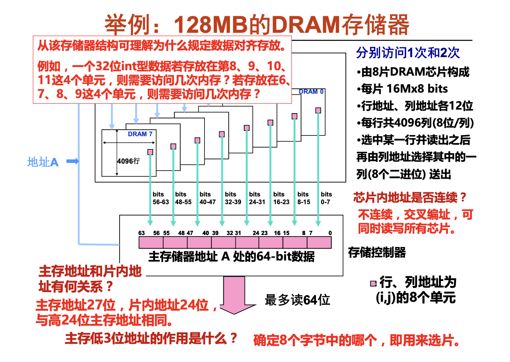
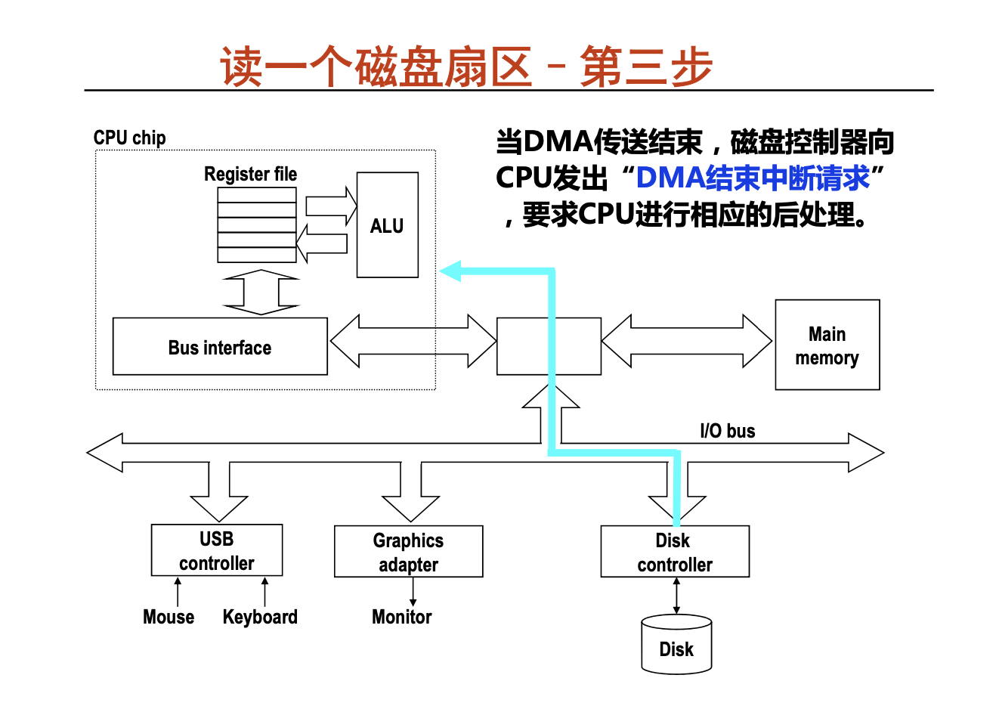
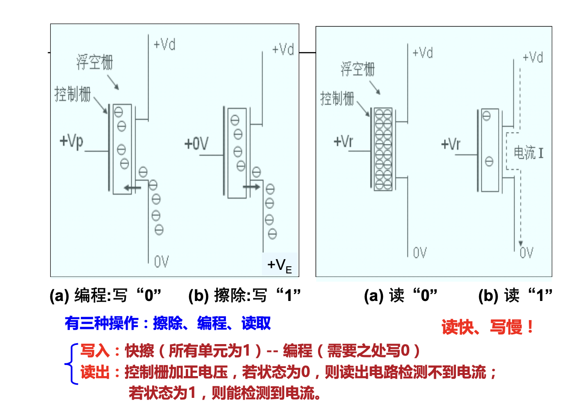

# 层次结构存储系统
2.1.1(引言)
存储器基本概念；主存的基本结构；主存的性能指标；半导体存储器组织(静态访问存储器与动态随机访问存储器的组织)；内存条与总线宽度；CPU与主存模块的连接及读写操作；

2.2.1(访问操作和基本术语)

访存很重要

**基本术语**
* 记忆单元 (存储基元 / 存储元 / 位元) (Cell)
  * 具有两种稳态的能够表示二进制数码0和1的物理器件
* 存储单元/编址单位(Addressing Unit)
  * 具有相同地址的位构成一个存储单元，也称为一个编址单位
* 存储体/ 存储矩阵 / 存储阵列(Bank) 
  * 所有存储单元构成一个存储阵列
* 编址方式(Addressing Mode) 
  * 字节编址、按字编址
* 存储器地址寄存器(Memory Address Register- MAR) 
  * 用于存放主存单元地址的寄存器
* 存储器数据寄存器( Memory Data Register-MDR (或MBR) )
  * 用于存放主存单元中的数据的寄存器

2.2.2(存储器分类)
**依据不同特性有多种分类方法**
1. 按工作性质/存取方式分类
   * 随机存取存储器 Random Access Memory (RAM)
     * 每个单元读写时间一样，且与各单元所在位置无关。如:内存。对地址进行译码以后进行读写。
        (注:原意主要强调地址译码时间相同。现在的DRAM芯片采用行缓冲，因而可能因为位置不同而使访问时间有所差别。)
   * 顺序存取存储器 Sequential Access Memory (SAM)
     * 数据按顺序从存储载体的始端读出或写入，因而存取时间的长短与信息所在位置有关。例如:磁带。
   * 直接存取存储器 Direct Access Memory(DAM)
     * 直接定位到读写数据块，在读写数据块时按顺序进行。如磁盘。 
   * 相联存储器 Associate Memory(AM)
        Content Addressed Memory (CAM) 
     * 按内容检索到存储位置进行读写。例如:快表。cache
2. 按存储介质分类
    半导体存储器：双极型，静态MOS型，动态MOS型
    磁表面存储器：磁盘(Disk)、磁带（Tape）
    光存储器：CD，CD-ROM，DVD
3. 按信息的可更改性分类
    读写存储器（Read/Write Memory）：可读可写
    只读存储器（Read Only Memorty）：只能读不能写
4. 按断电后信息的可保存性分类
    非易失（不挥发）性存储器（Nonvolatile Memory）
        信息可一直保留，不需电源维持。
        （如：ROM、磁表面存储器、光存储器等）
    易失（挥发）性存储器（Volatile Memory）
        电源关闭时信息自动丢失。（如：RAM、Cache等）
5. 按功能/容量/速度/所在位置分类
   * 寄存器(Register)
     * 封装在CPU内，用于存放当前正在执行的指令和使用的数据 
     * 用触发器实现，速度快，容量小(几~几十个)
   * 高速缓存(Cache)
     * 位于CPU内部或附近，用来存放当前要执行的局部程序段和数据 
     * 用SRAM实现，速度可与CPU匹配，容量小(几MB)
   * 内存储器MM(主存储器Main (Primary) Memory)
     * 位于CPU之外，用来存放已被启动的程序及所用的数据 
     * 用DRAM实现，速度较快，容量较大(几GB)
   * 外存储器AM (辅助存储器Auxiliary / Secondary Storage)
     * 位于主机之外，用来存放暂不运行的程序、数据或存档文件 
     * 用磁盘、SSD等实现，容量大而速度慢

write函数调用

2.3.1(主存的基本结构)

看书

2.4.1(主存的性能指标)

2.5.1(六管静态MOS管电路)

看视频，有拓展

速度快，占的面积大，**存储基元(位元)**

2.5.2(单管动态记忆单元电路)

2.5.3(半导体RAM的组织)

2.5.4(DRAM芯片举例)

textbook_P259
看视频

2.6.1(SPARCstation20的内存条)
  

行缓存；

2.6.2(PC中的内存条)
怎么计算引脚数

128Mb就是27位地址；前面的3位为芯片号，后面为12位的行地址，12位的列地址；

2.6.3(内存条与CPU的连接)

插内存时：只要将同色的三个内存插槽插上内存条，系统便会自动识别进入三通道模式(快)，标配6插槽

``-`` :表示低电平有效

2.7.1(主存模块的连接与读写操作)

多个芯片就交叉编址，所以一定连续。当列值解析完成后就好取？

操作过程，看textbookP_265

**本周小结**
* 按介质分半导体、磁表面和光盘存储器;按存取方式分随机访问、直接访 问、顺序访问和按内容访问存储器;按信息可更改性分只读、可读可写存 储器;按断电后的可保存性分易失性、非易失性存储器。
* 主存储器是易失性的、可读可写的、半导体随机访问存储器。
* 主存储器芯片中存放信息的称为存储阵列;每个存储阵列包含若干个存储 单元，每个存储单元由若干个记忆单元(cell)构成，每个记忆单元存放一 位信息(0或1)。
* 记忆单元有静态(六管)和动态(单管)两种，前者为SRAM，后者为 DRAM。内存条中芯片为DRAM芯片，每个芯片有一个行缓存(用SRAM 实现)。
* 主存和CPU之间通过存储器总线(内存条插槽)相连。主存地址由CPU送 出;数据信息可以是CPU到主存，或相反。

## 磁盘存储器
3.1.1(引言)
磁盘存储器的结构；磁盘驱动器及其操作过程；磁盘存储器的组成；磁盘存储器与主机的链接与读写操作；固态硬盘SSD的基本原理；

3.2.1(磁盘存储器的结构)

3.3.1(磁盘驱动器以及操作过程)
内外移动;磁头同进同出；柱面就是磁道号；盘片就是磁头号；

3.4.1(磁盘存储器的组成)

3.5.1(磁盘存储器的链接与操作)

磁盘的最小读写单位是扇区，因此，磁盘按成**批数据交换方式**进行读写，采用直接存储器存取(DMA，Direct Memory Access)方式进行数据输入输出，需用专门的DMA接口来控制外设与主存间直接数据交换，数据不通过CPU。通常把专门用来控制总线进行DMA传送的接口硬件称为DMA控制器
磁盘控制器链接在I/O总线上，I/O总线与其他总线(系统总线、存储器总线)之间用桥接器连接
**三步走**
1. CPU对磁盘控制器初始化：
    读命令
    磁盘逻辑块号
    主存起始地址（磁盘的起始地址）
    然后启动磁盘驱动器工作
在磁盘与内存进行数据交换的过程中，CPU进行其他操作；
2. 磁盘控制器读相应的扇区，并按DMA方式把数据送主存。由DMA控制器或磁盘内DMA控制逻辑控制总线完成。还与CPU并行工作，（内有字计数器计入在内，传送的字的个数传在里面，最后为0）
3. 当DMA传送结束，磁盘控制器向 CPU发出“DMA结束中断请求” ，要求CPU进行相应的后处理。

固态硬盘(SSD)
* 它用闪存颗粒代替了磁盘作为存储介质，利用闪存的特点，以区块写入和抹除的方式进行数据的写入。
* 写操作比读操作慢得多。顺序读比顺序写大致快一倍，而随机读比随机写大 致快10倍。 随机读写延时比硬盘低两个数量级(随机读约为几十微秒，随机写约为几百微秒)
* 一个闪存芯片由若干个区块组成，每个区块由若干页组成。通常，页大小为 512B~4KB，每个区块由32~128个页组成，因而区块大小为 16KB~512KB，数据可以按页为单位进行读写。
* 当需要写某页信息时，必须先对该页所在的区块进行擦除操作。一旦一个区 块被擦除过，区块中的每一页就可以直接再写一次。若某一区块进行了大约 100 000次重复写之后，就会被磨损而变成坏的区块，不能再被使用。因此 ，闪存翻译层中有一个专门的均化磨损(wear leveling)逻辑电路，试图 将擦除操作平均分布在所有区块上，以最大限度地延长SSD的使用寿命。由 此可见，对于物理区块的写优化是由SSD中的硬件实现的，无需软件进行写 优化。

4.1.1(引言)
Cache和存储器层次结构(在存储器层次结构的位置)；Cache和主存的关系；实现Cache需解决的问题；Cache映射方式；Cache命中率和缺失率；Cache的关联度；
