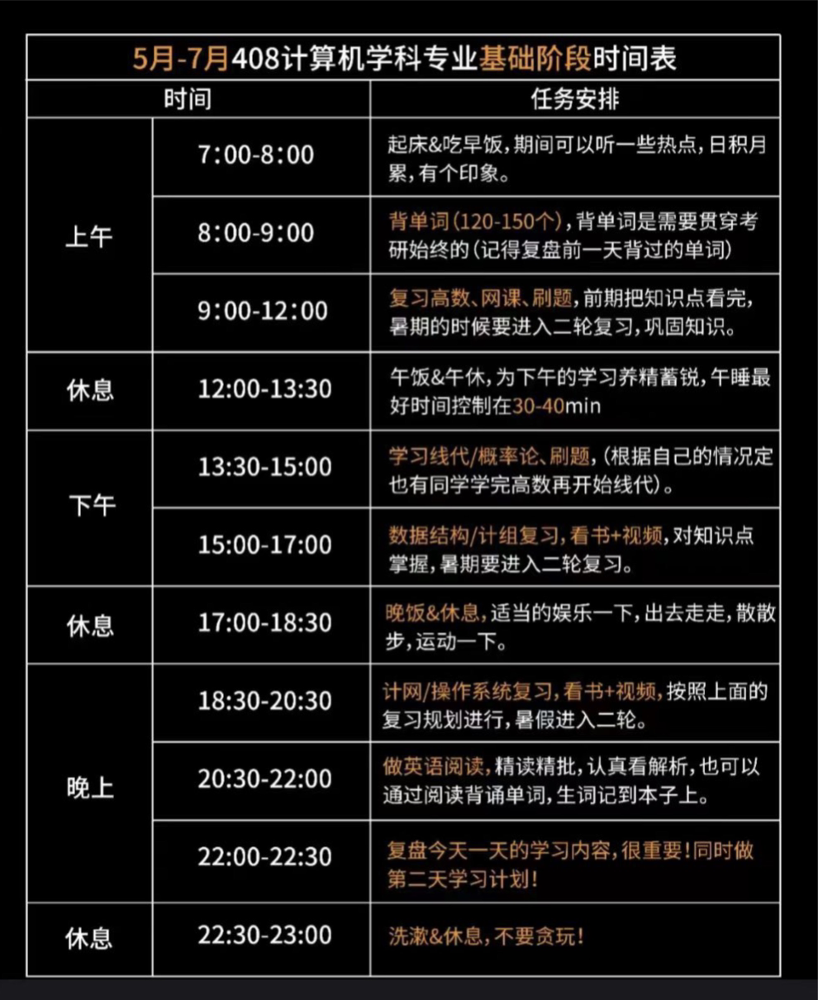

# Think it
最根本的行动指南
干事情,永远要与世界打交道,就首先要有入世的心,认识到自己的位置。用明白世界如此发展,但就是要决然去闹个明明白白的闯劲。一方面,要理解世界变化万千，另一方面,自身决然入世的这一股劲就更重要了。
考研：一天的学习，缺少把这个活动看成一个科学地去把握合理安排,不断去变化,去安排去认识,去实践的能力。
满脑子知识,却动不动就玩会儿,学习需要两种人格：灯下黑的远眺者与埋头苦干以至于时常搞不清楚方向的实干家。
远眺者盘算着未来包括我当下的思索,而实干者就是要在广袤的土地上学会脚踏实地地耕耘,用心去把握谷物的生长,顺着远眺者的计划,日起而作,日落而息。

善于记笔记，搞清楚自己为啥困顿，比躺着刷手机强
# Plan it as living
把要干的想具体，不然就会忘
每天的计划-----作为整体:本身怎么学，计算机不懂的一定会难受，，，要有切入的角度

发现的问题-----作为局部,在这个切入角度，多感受的总结认识。
以及在认识中的变化
做笔记，思维的想法要好好固化，以便反思。

积极的自我暗示，学着变化，会安排好这些
It is a mistake to look too far ahead. Only one link in the chain of destiny can be handled at a time.

## daily plan
做每天的计划，就是要为没有发生的事情进行规划；为实干者指明一条道路

把每天的**硬性指标**，每天想好，做完就搞别的，规避抓着一个咬死

数学：线代: chap3.chap4
计算机：计网：chap3.chap4
英语：韦小绿:30min;葛旭,方法论总结，
学习的时候，还是搞懂点，沿着考研点走，不行的善于学习又要

晚上的时候考虑，看一下，葛旭的课，没太多内容；白云的留白天听
### 具体的想想
数学：线代，一天两章
微积分，

计算机：数据结构: 8.2 :tree and map
计网

英语；

## 计划的规划与切入角度
1. Future plan
    1. cs61b
    2. cs61c
    3. ics_nju
    4. cs162

2. living struggle
    1. [408](./Note_controller/408/daily_note.md)
    2. [数学](./Note_controller/math/learning_control.md)

## 学习方法
对所有课程的学习，一定要学会总结，学习东西绝非一蹴而就，总结就是对这个复杂系统的抽象，
学习的时候，感觉到困难就是自己没想清楚，下面的计划。
干累了，就要想好换什么，不仅要想好，更一定要换！！！
* 408总结
### English
[note](./Note_controller/English/Methods.md)
* Lonely Reader
* 韦小绿
#### 背单词，作文，对文意的分析理解
* 韦小绿---给记单词一个角度
* 西简--白云、船长的技巧...---读西简，练技巧

* add a markdown dedicted to word reminding.

### 数学
[一些想法](https://www.bilibili.com/video/BV1Hn4y1f7gc/?spm_id_from=333.1007.top_right_bar_window_history.content.click&vd_source=200de2063d50f5bf2560cfd0c5dd0c61)
### 408
Finish cs61c before nju_ics, not absolutely. Practice in reality.
怎么调和好

## Feelings
now A very strong feelings that 真正无所事事的正是无所事事本身：刷手机就像是对自身的放游
做事情的时候，总给我一种感觉，这个还有那个，一步步搞，摆正心态: 搞不清楚自己是什么了(重要的是激情)
没有了激情，要有决断：休息一会，散步，给别人聊会天，听会歌
要积极的思考学习的状态，学习新的东西——一定会难受
怎么刷题——对这些东西的优先级——切入的角度要有清楚的认识。

When reading a bit boring, check a music firmly.快刀斩乱麻
其实该想想要听什么：promote your study
* 王道的强化
* 数学--梦言
* 英语--孤阅
1. [瓦格纳](https://www.bilibili.com/video/BV1BU4y187ck)
When inspired, change.
2. [布鲁克纳](https://www.bilibili.com/video/BV1ez4y1j71w)

* read_it [weread](https://weread.qq.com/)

## Excited
来点激情
[SHOSTAKOVICH](https://www.bilibili.com/video/BV1Hx411W7uj?p=11)